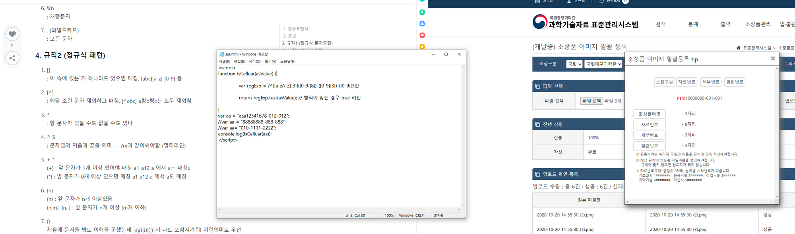
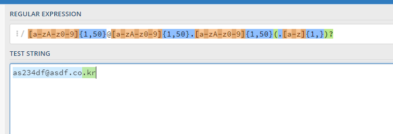
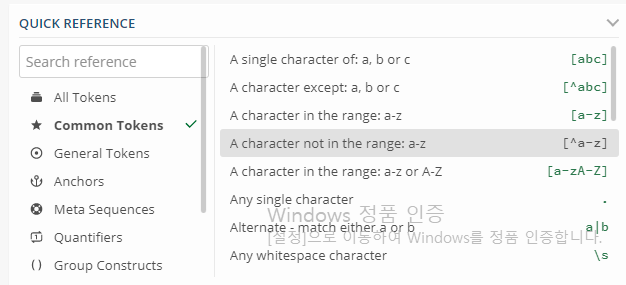
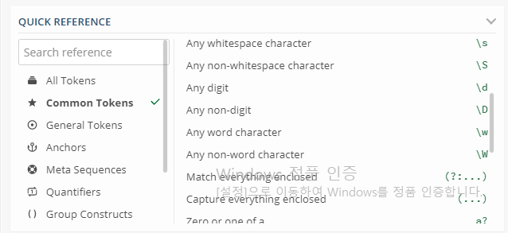
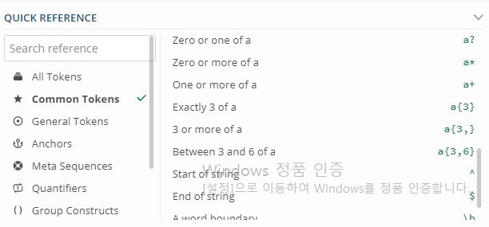
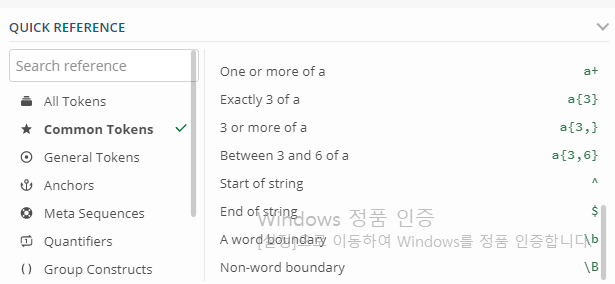
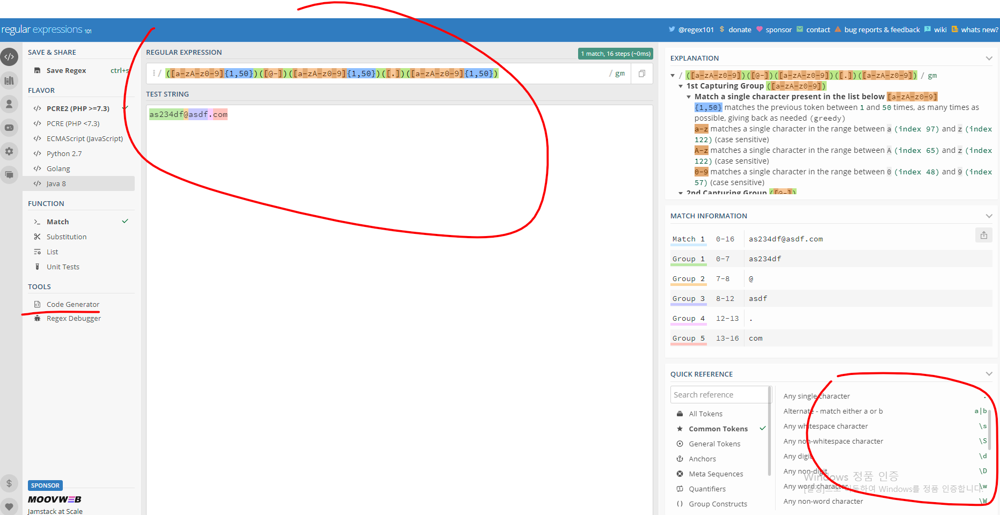
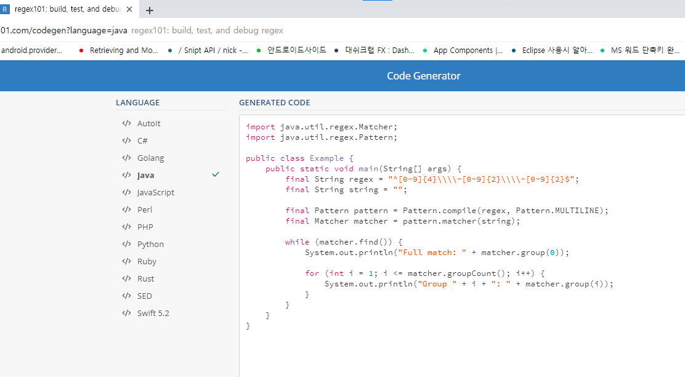

# 예시

- `([a-zA-Z]{3})([0-9]{8})-([0-9]{3})-([0-9]{3})`

- `[a-zA-z0-9]{1,50}@[a-zA-z0-9]{1,50}.[a-zA-z0-9]{1,50}(.[a-z]{1,})?`

# 기본 개념

- `( )`으로 그룹핑을 할 수있음
    - 그룹핑 한건 저장(capture)를 하기 때문에, 필요한 경우에만. 과도하게 모두 할 필요는 없음
- `[ ]`으로 식을 쓸 수 있음
- `{ }`으로 길이를 정할 수 있음
- `-` `\` 등 몇몇 문자는 정규식 사용문자 혹은 프로그래밍 언어에서 사용되는 특수문자이므로 이스케이프가 필요함
- `^` 는 반대를 의미함
    - `[^0-9]` : 0~9가 아닌것

# 글자 확인

> [식]

- 안에 들어갈 Character가 영어만 가능하게 할 경우
    - `[a-zA-z]`
- 안에 들어갈 Character가 숫자만 가능하게 할 경우
    - `[0-9]`
- a 혹은 b (단일 Chracter)
    - `[ab]`
- word1 혹은 word2 (단어)
    - `[word1|word2]`
- 아무 1글자
    - `.`
- 아무 공백
    - `\s`
- 알파벳이 있을수도 있고 없을수도 있고
    - `(.[a-z]{1,})?`

# 길이 확인

> {n} 혹은 {n, m}

- n자리만
    - `{n}`
- n에서 m자리
    - `{n, m}`
- n자리 이상
    - `{n, }`

# 문구 형식

> (내용) 외에 형식을 작성 (예: (내용)-(내용)-(내용))

- (숫자, 최소1자리)-(숫자, 최소1자리)-(숫자, 최소1자리)
    - `[0-9]{1,}-[0-9]{1,}-[0-9]{1,}`
- (숫자, 3자리)-(숫자, 1~4자리)-(숫자, 4자리)
    - `([0-9]{3})-([0-9]{1,4})-([0-9]{4})`
- (숫자, 알파벳대소문자, 1~50자리)@(알파벳소문자).(알파벳소문자).(알파벳소문자,필수아님)
    - `[a-zA-z0-9]{1,50}@[a-zA-z0-9]{1,50}.[a-zA-z0-9]{1,50}(.[a-z]{1,})?`

# 참고

- [https://regex101.com/](https://regex101.com/)
    - 테스트 가능
    - 언어별 정규식 변환 가능
    - 기본 정규식 문법 제공

## 정규식 제공

## 정규식 테스트

## 언어별 정규식 생성

- code generator (정규식은 언어마다 미묘하게 다르므로 언어별로 적절한 정규식을 생성해줌)