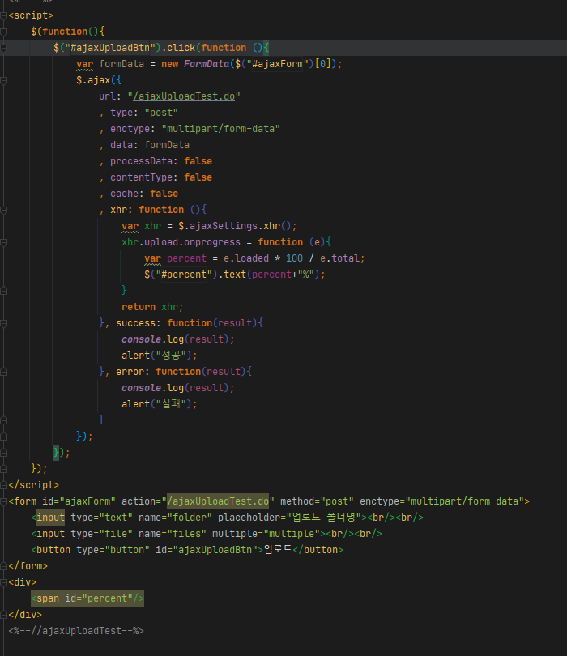
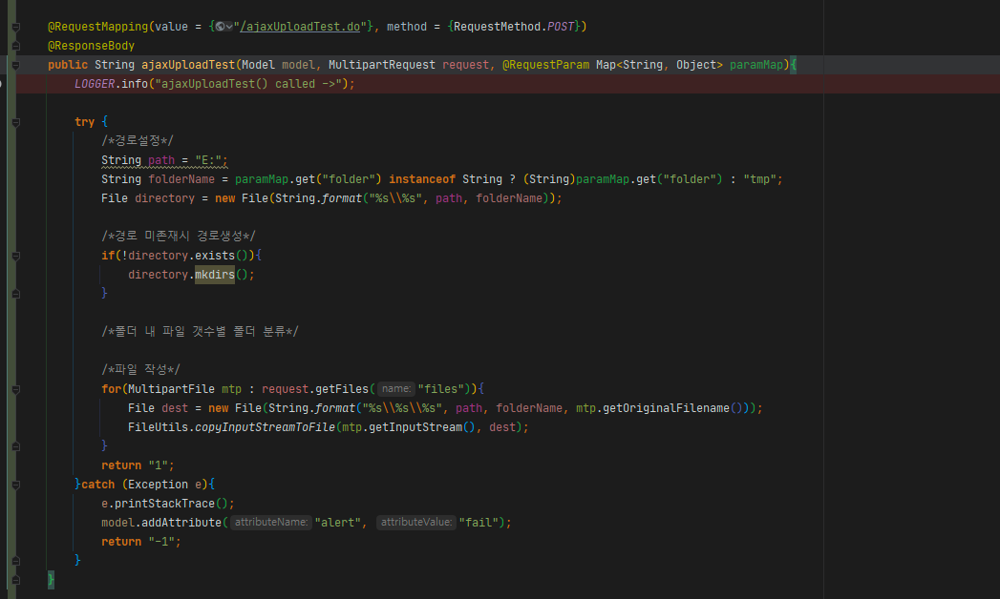

- FormData : ajax로 요청을 보낼땐 보통 JSON.stringify를 이용해 JSON구조로 데이터를 보낸다. 그러나 데이터가 파일일땐 폼구조로 보내게 된다. (물론 base64나 buffer, 이진데이터도 가능은 하지만 바람직하지 않음). 비동기로 폼전송을 할때엔 FormData 객체를 사용한다. FormData는 폼[0]을 해도 되고, formData.append(K, V)로 원하는 형식을 직접 집어넣어도 된다.
- enctype : multipart/form-data 필수.
- processData, contentType : false 필수.
- xhr : 서버로의 데이터 전송상황을 확인하기 위해 사용되는 객체. 클라이언트→서버로의 전송상황은 표현이 가능하지만 서버가 출력스트림으로 파일을 작성하는 상황은 확인할 수 없음. 클라이언트와 연결 없이 서버가 알아서 하는 작업이기 때문에.

# 참고

- [https://myhappyman.tistory.com/178](https://myhappyman.tistory.com/178)