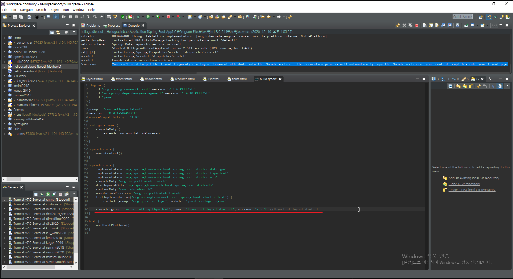
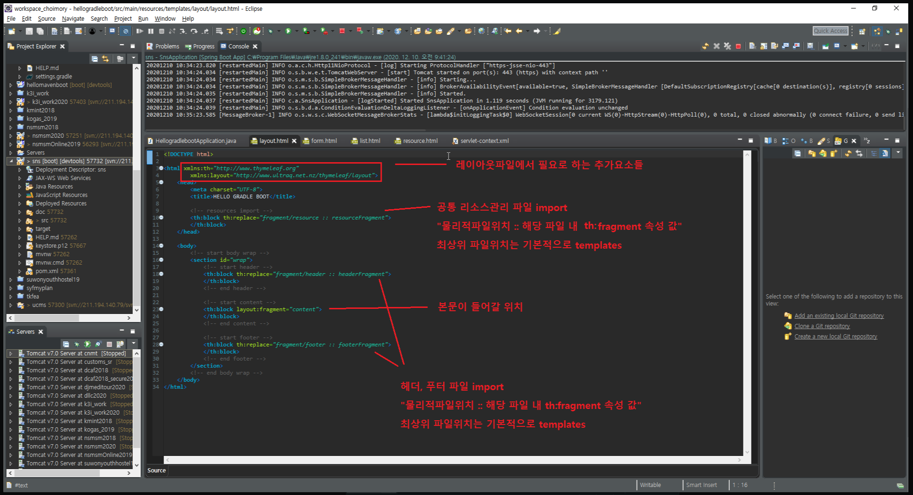
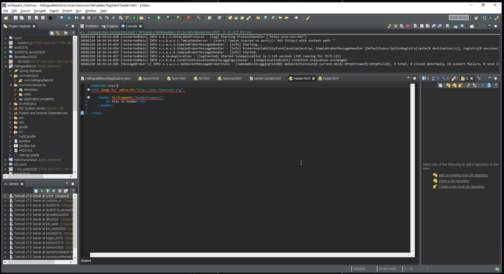
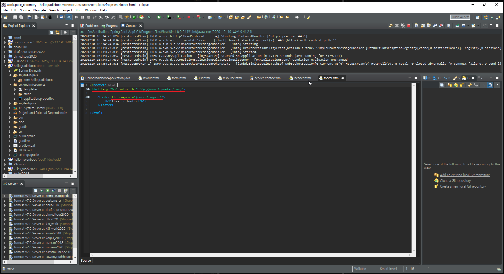
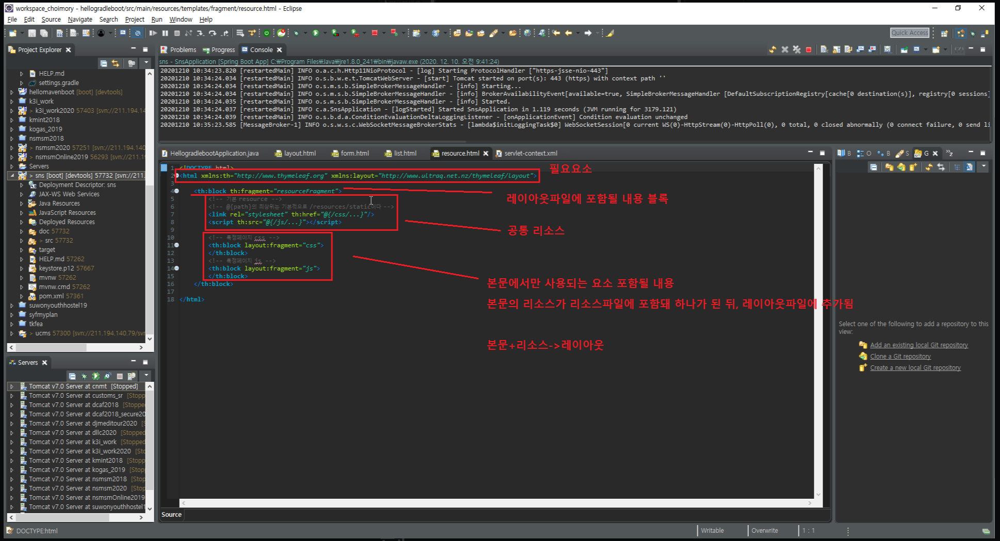
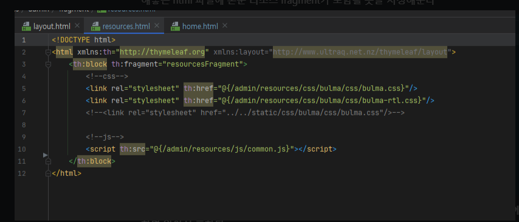
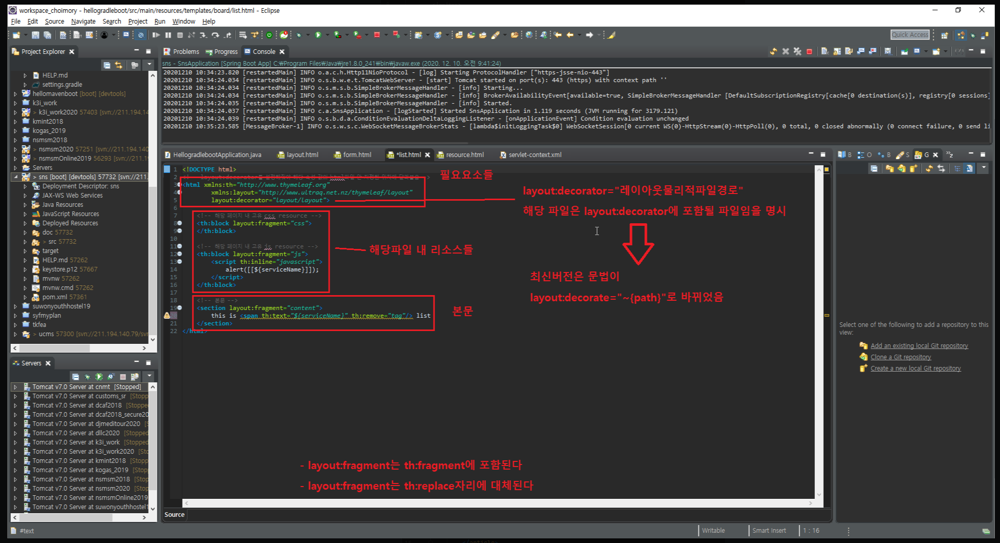
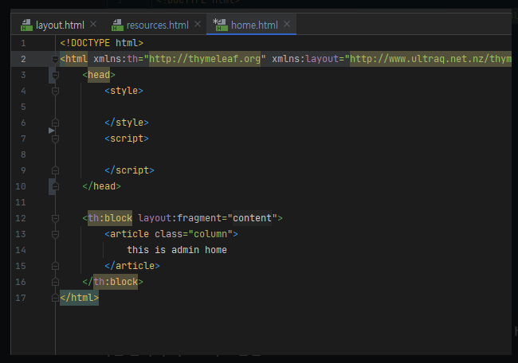

# gradle

thymeleaf-layout-dialect 추가

# 전체 레이아웃

# 헤더, 푸터

# 리소스

- Thymeleaf 2 이하인 경우 본문의 리소스도 fragment로 묶어서 가져와야 하므로, 리소스만 작성해놓은 html 파일에 본문 리소스 fragment가 포함될 곳을 지정해준다

- Thymeleaf 3에서는 본문의 리소스는 fragment를 사용할 필요 없이 본문의 head태그 내에 작성하면 알아서 포함됨

# 본문

- Thymeleaf 2 이하인 경우 본문의 리소스도 fragment로 묶어서 가져와야 하므로, 리소스만 작성해놓은 html 파일에 본문 리소스 fragment가 포함될 곳을 지정해준다

- Thymeleaf 3에서는 본문의 리소스는 fragment를 사용할 필요 없이 본문의 head태그 내에 작성하면 알아서 리소스가 포함됨