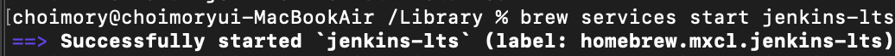
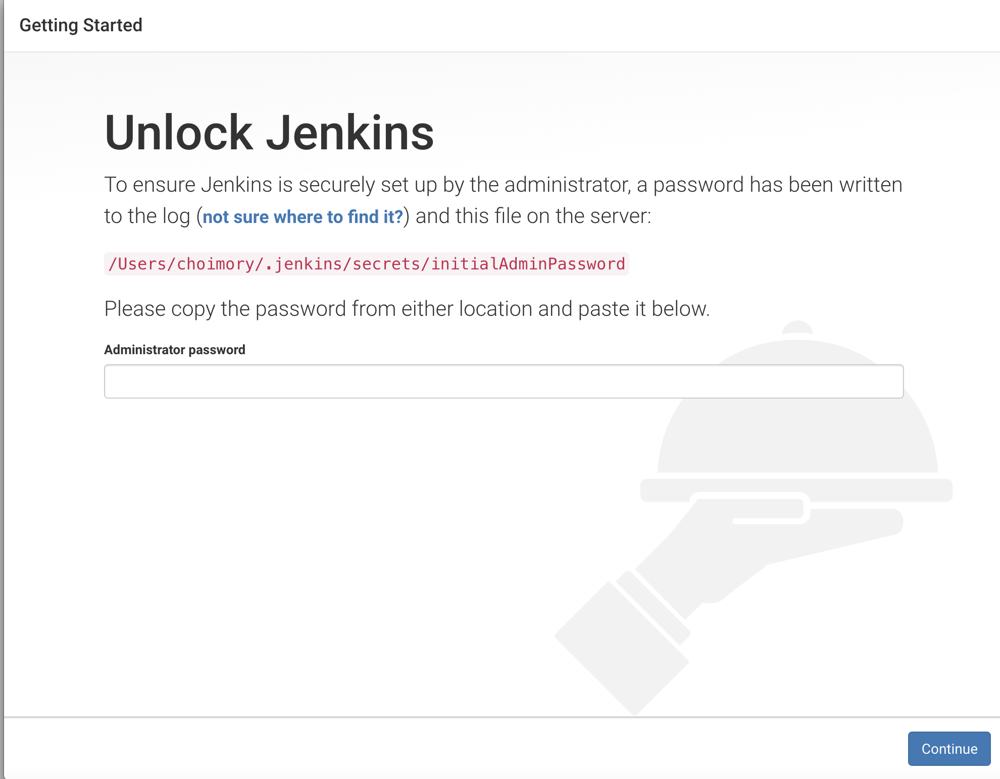
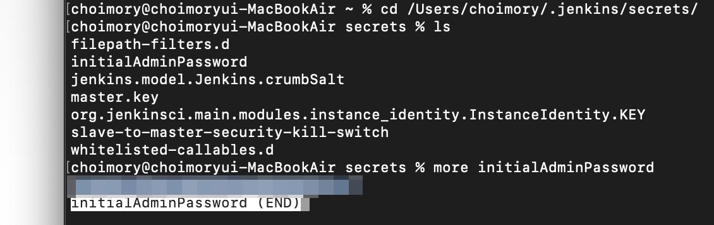
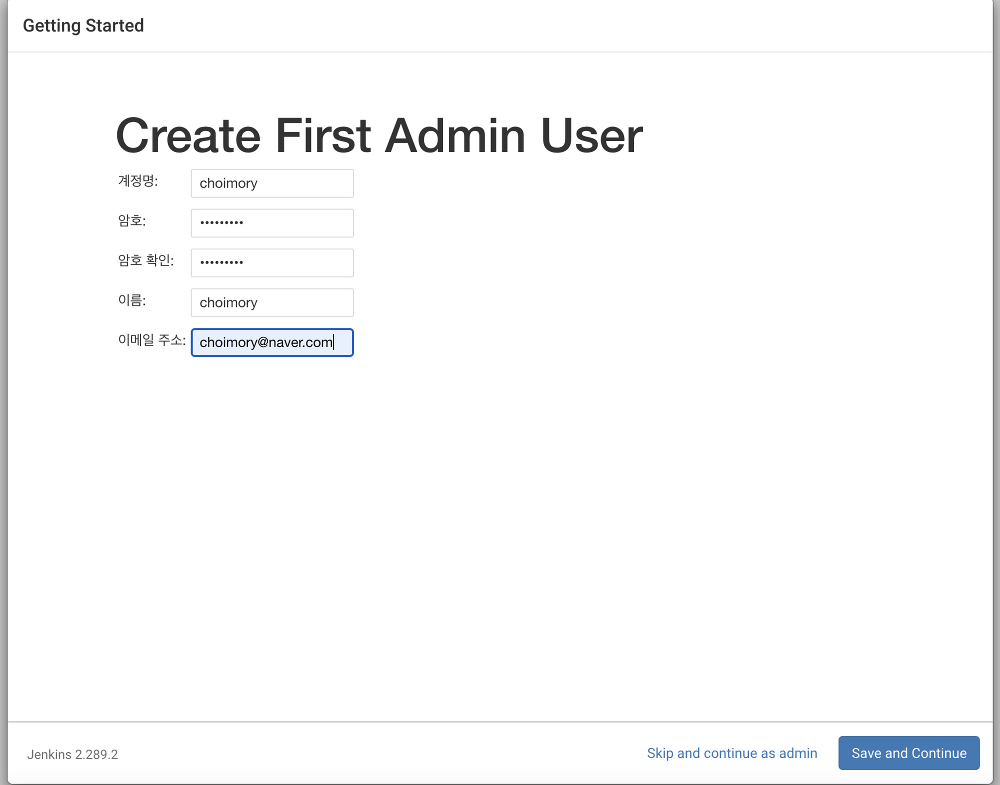
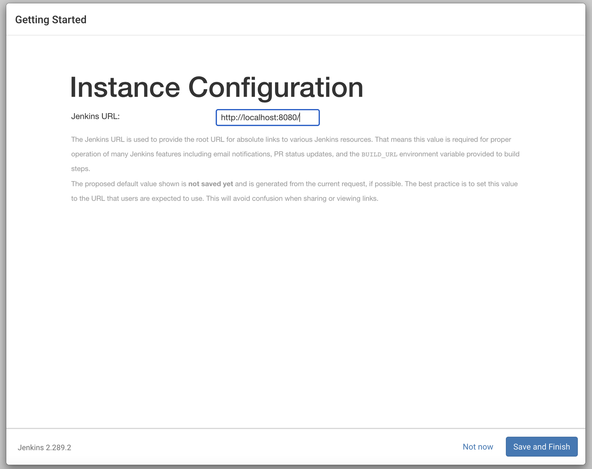

# 개요

- 젠킨스 설치하는법을 작성

# 맥

- brew install jenkins-lts

- brew services start jenkins-lits
- localhost:8080 접속

- 해당 경로의 파일 읽어서 안에 써있는 비밀번호 입력
- 플러그인 선택 및 설치

- 계정 생성

- URL 설정
- 포트 바꿔도 안먹힘 주의

# 윈도우

- jenkins.msi 파일 다운로드 및 실행
- 포트 정하고 로컬호스트:포트 접속
- 해당 경로의 파일 읽어서 안에 써있는 비밀번호 입력
- 설치