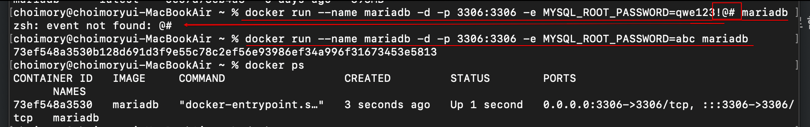
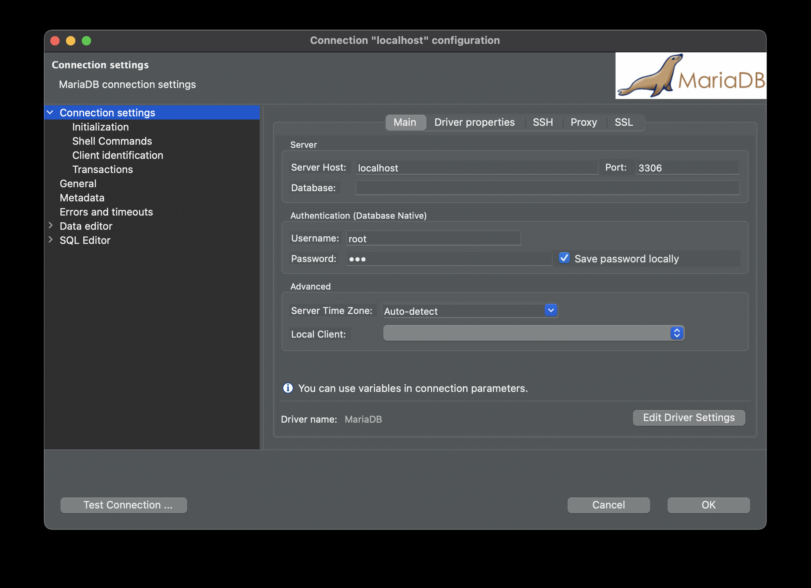
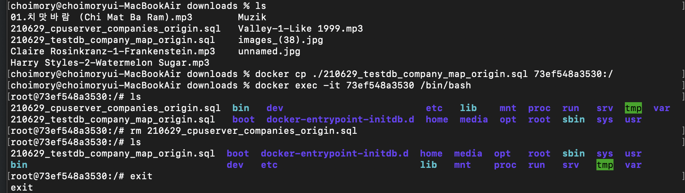
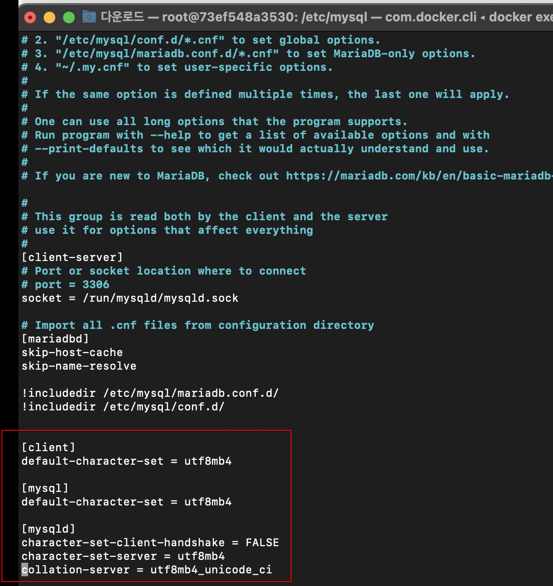
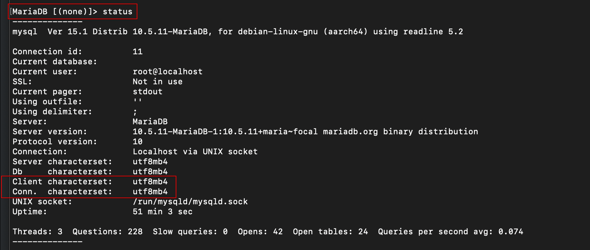
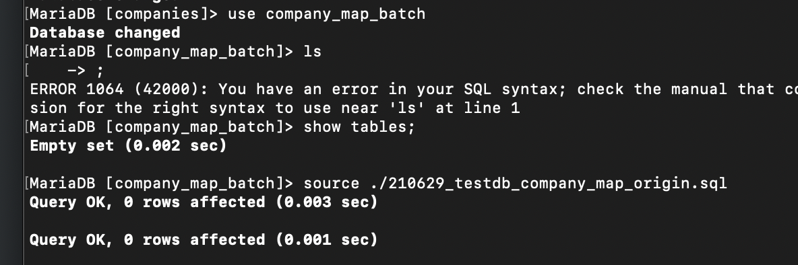

# 개요

- homebrew에 dbms 관련된 것들이 보이질 않아서 로컬에 DB를 설치하지를 못해, 그냥 도커로 DB컨테이너 띄워서 사용했음
- 예제는 Mariadb를 사용

# docker hub 에서 이미지 pull

- docker hub에서 원하는 이미지를 검색하여 해당 이미지 pull
- `docker search mariadb`, `docker pull mariadb`

# 이미지 실행하여 컨테이너 생성



- 다운받은 이미지를 실행함
- 실행시 root 비밀번호를 정해줘야함
- `docker run --name mariadb -d -p 외부포트:내부포트 -e MYSQL_ROOT_PASSWORD=비밀번호 mariadb`
    - `--name`: 컨테이너 이름 등록
    - `-d`: 데몬 실행
    - `-p`: 외부포트:내부포트 등록
    - `-e` : 환경변수 설정
    - 비밀번호에 특문들어갈시 도커명령어와 혼선이 와서 문제가 생기는 상황이 있음

# DBeaver 연결



- 로컬호스트, 컨테이너 생성할때 정해놓은 외부포트로 접속하면됨
- 근데 컴퓨터에 DB 설치조차 안되있어서 Local Client가 없으므로 dump/restore 등의 기능이 안됨

# 호스트 → 컨테이너로 파일 이동



- 컴퓨터에 DB 설치조차 안되어 있으므로 dbeaver에서는 restore가 안되서, 그냥 dump 파일 restore를 컨테이너 내에서 CLI로 진행하기로 함
- 그래서 덤프한 sql 파일을 컨테이너로 옮겨야함
- `docker cp 호스트파일경로 컨테이너명:복사할경로`
    - 반대로 컨테이너 파일을 호스트로 빼낼땐 `docker 컨테이너명:파일경로 복사할호스트경로`

# 컨테이너 내부 접속

- `docker exec -it 컨테이너ID /bin/bash`

# mariadb 인코딩 환경설정

- DBMS의 클라이언트, 커넥션 관련 인코딩 환경설정을 latin1에서 utf8mb4로 변경해줌
- 컨테이너에 vi가 없으므로 vi를 먼저 설치함
    - (우분투) `apt-get update && apt-get install nano vim`
- /etc/mysql/my.cnf를 편집한다
    - `vi /etc/mysql/my.cnf`
- my.cnf에 해당 내용을 추가해줌

  

    ```java
    [client]
    default-character-set = utf8mb4

    [mysql]
    default-character-set = utf8mb4

    [mysqld]
    character-set-client-handshake = FALSE
    character-set-server = utf8mb4
    collation-server = utf8mb4_unicode_ci
    ```

# mysql cli 접속

- `mysql -uroot -p비밀번호`

# 인코딩 설정 확인



- `status`

# dump 파일 restore



- DB 접속, 스키마접속 후 restore하는 방법
    - DB 접속
        - `mysql -u사용자명 -p비밀번호`
    - 사용할 스키마 접속
        - `use 스키마명`
    - dump파일 restore
        - `source 파일경로/파일명.sql`
- mariadb 및 사용할 스키마 접속하지 않고 바로 restore하는 방법
    - `mysql -u사용자명 -p비밀번호 스키마명 < sql파일경로`

# 결과

- docker 컨테이너 구동시킨 후, DBeaver에 localhost:3306으로 접속 시 정상 접속 확인
- private한 내용이므로 사진 생략

# 출처

- [https://firework-ham.tistory.com/105](https://firework-ham.tistory.com/105)