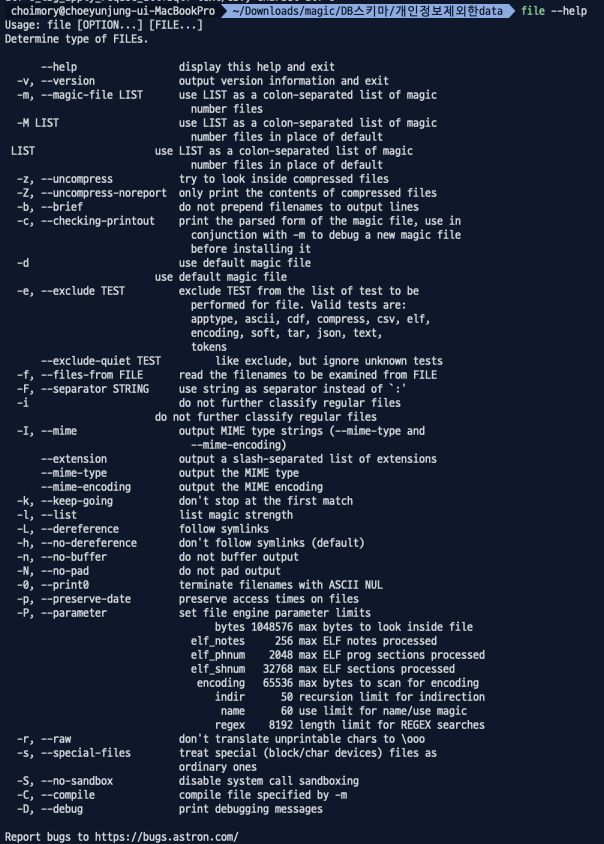

# 개요

- csv 등의 파일을 열어보니 인코딩 문제로 데이터가 깨졌을때, 파일 인코딩을 확인하고 변경하는 법을 알아봄.

# 파일 확인

> file 명령어를 통해 파일 종류를 확인할 수 있다
> file 명령어 안될시 해당 관련 설치가 필요

- `file -I 파일명`: 해당 파일의 파일명, 파일 타입, 인코딩 종류를 알 수 있음.
- `file -I *`: 해당 디렉토리 내 모든 파일의 타입과 인코딩 종류를 알 수 있음.
- e.g. `file -I abc.txt`, `file -I *`

# 파일 변환

> iconv 명령어를 통해 파일을 변환할 수 있다.

- `iconv -c -f [바꿀 파일의 인코딩종류] -t [변경할 인코딩종류] [기존 파일명] > [변경할 인코딩으로 새로 생성할 파일명]`
  - e.g. `ìconv -c -f euc-kr -t utf-8 former.txt > new.txt`
- 결과 파일이 나오면 인코딩 성공, 안나오면 해당 파일의 현재 인코딩이 해당내용이 아닌것

# 참고

- [https://technote.kr/206](https://technote.kr/206)
- [https://www.geeksforgeeks.org/file-command-in-linux-with-examples/](https://www.geeksforgeeks.org/file-command-in-linux-with-examples/)
- [https://kingname.tistory.com/194](https://kingname.tistory.com/194)