# 개요

- 내부만 허용되고 외부에는 허용되지 않은 내부망의 특정지점에 접근하려면, 일단 내가 내부망 안에 있어야한다
- 근데 내가 외부에 있는데 내부망에만 허용된 특정지점에 가고 싶다면?
- 외부에서 → 외부에 오픈된 외부망에 접속하여 내부망에 진입(터널뚫고) → 들어온 내부망에서 원하는 내부망으로 포트 포워딩(터널링)

# 가정

- 외부접속 허용된 외부망 하나
- 외부접속 차단된 내부망 하나
- 해당 내부망에 서비스로
    - 내부망:5601 → 키바나
    - 내부망:9200 → 엘라스틱서치
    - 내부망:3306 → MySQL
- 들이 올라가 있고, 키바나와 엘라스틱서치는 브라우저 접속, MySQL은 JDBC 드라이버 접속한다고 가정

# Mac

- 터미널에 원격접속 및 포트포워딩 명령어를 입력하여, ssh 터널링으로 세션을 연결한다

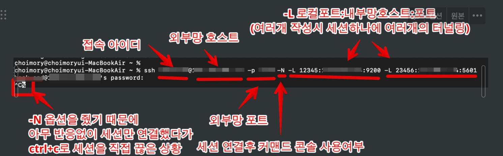

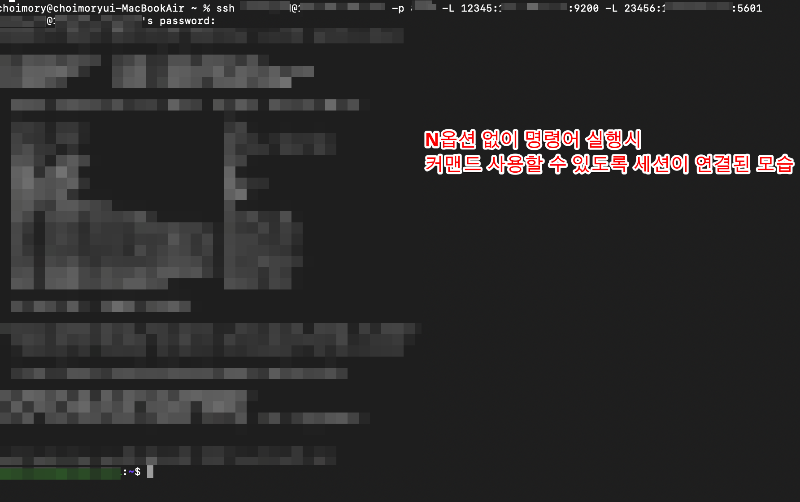

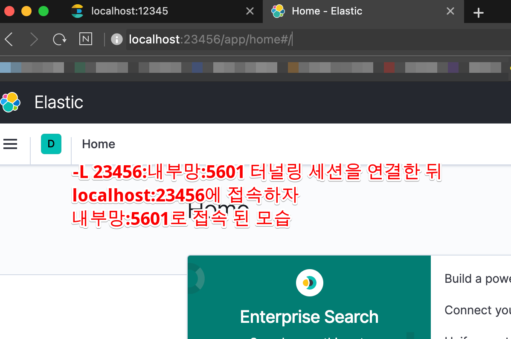

`ssh 아이디@외부망 -p 외부망포트 -N -L 로컬포트:내부망호스트:내부망포트 -L 로컬포트2:내부망호스트:내부망포트2...`

- `-N` : 커맨드 콘솔 안쓰고 세션만 연결하고 싶을시 -N 옵션을 주면 된다. -N 옵션 없을시 커맨드도 사용하면서 터널링 세션을 사용하게 된다
- `-L`: 로컬→리모트로의 포트포워딩을 할때 `-L` 옵션을 준다

# 윈도우

- Xshell, Putty등의 원격접속 프로그램을 이용한다
- 원격접속시 프로그램의 ssh 터널링 기능을 이용해 포트포워딩한다
- Xshell은 터널링을 적용한 세션까지 별도 저장이 가능하지만, Putty는 단순 세션 저장만 가능하고 터널링정보까지는 저장되지 않아서 Xshell이 좀 더 편리하다고 할 수 있다

## Xshell

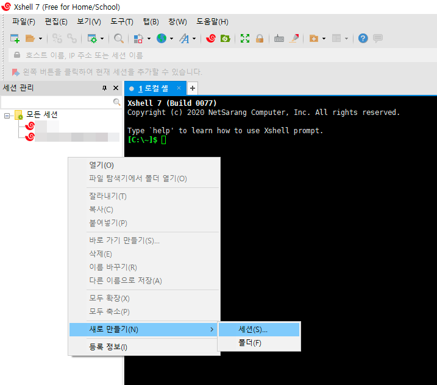

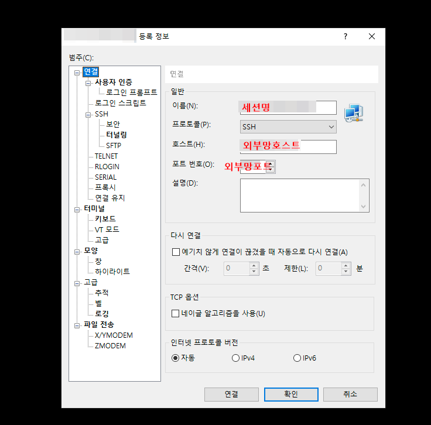

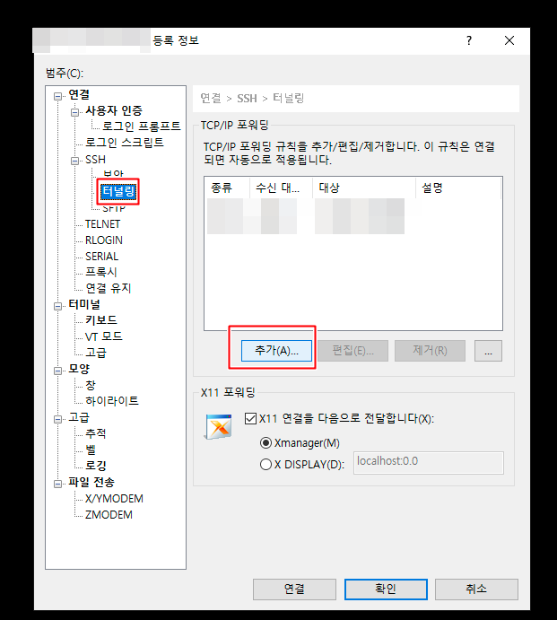

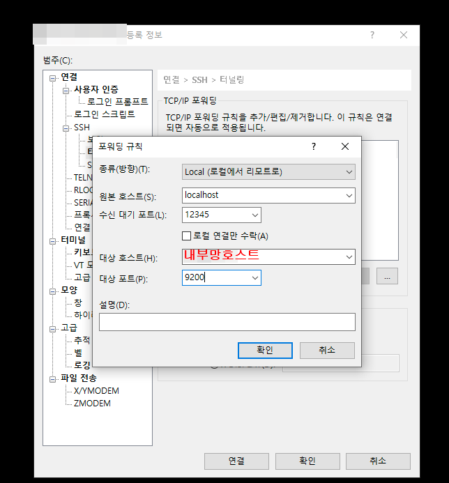

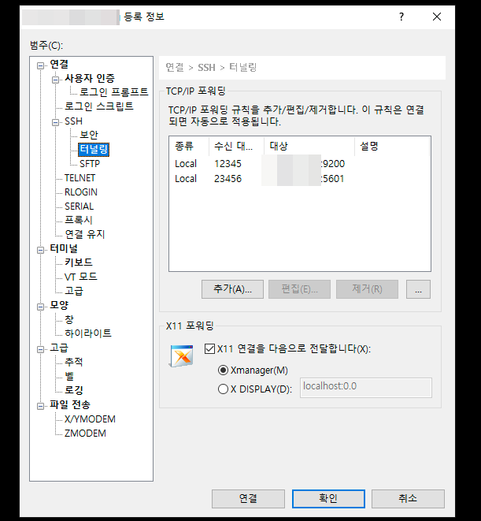

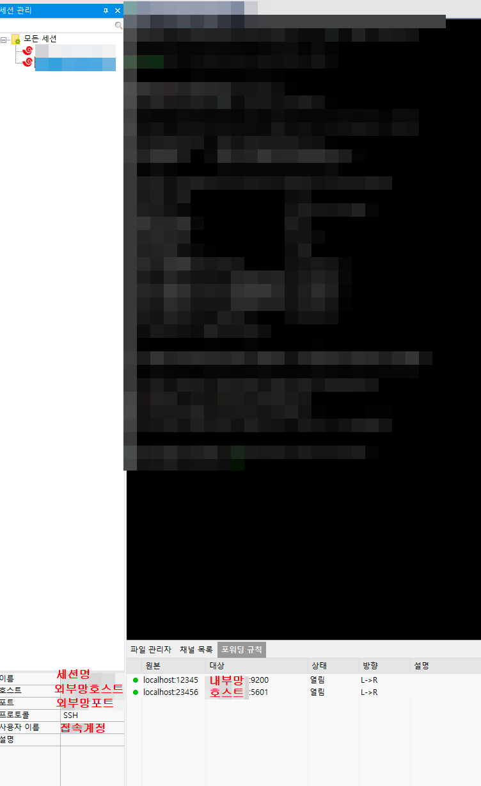

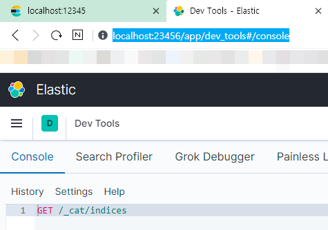

- 원격접속 세션을 만들때 SSH 터널링 옵션이 있는데, 거기서 포트포워딩 규칙들을 입력해준다

## Putty

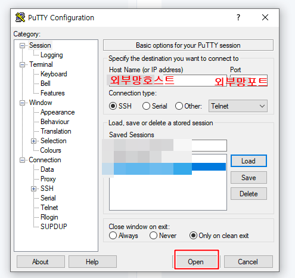

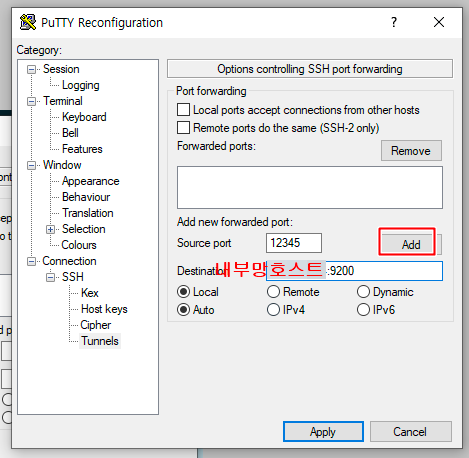

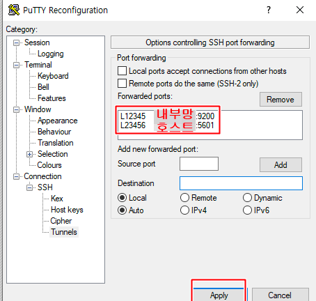

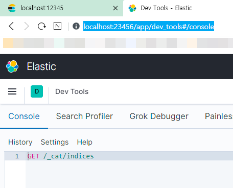

- 일반적인 원격접속 방식으로 세션 연결
- 이후 세션설정을 변경하는곳으로 들어가 SSH 터널링 옵션에서 포트포워딩 규칙들을 추가해준다(포트포워딩 규칙들은 저장안됨)

# Mac 및 윈도우에서 DBeaver로 DB를 ssh 터널링으로 연결

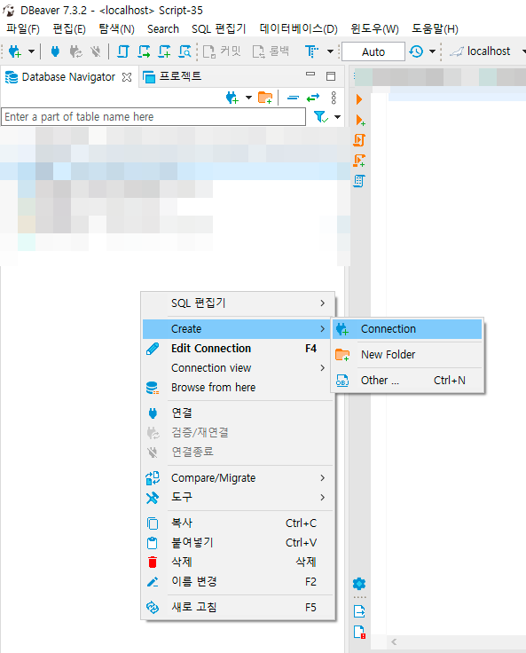

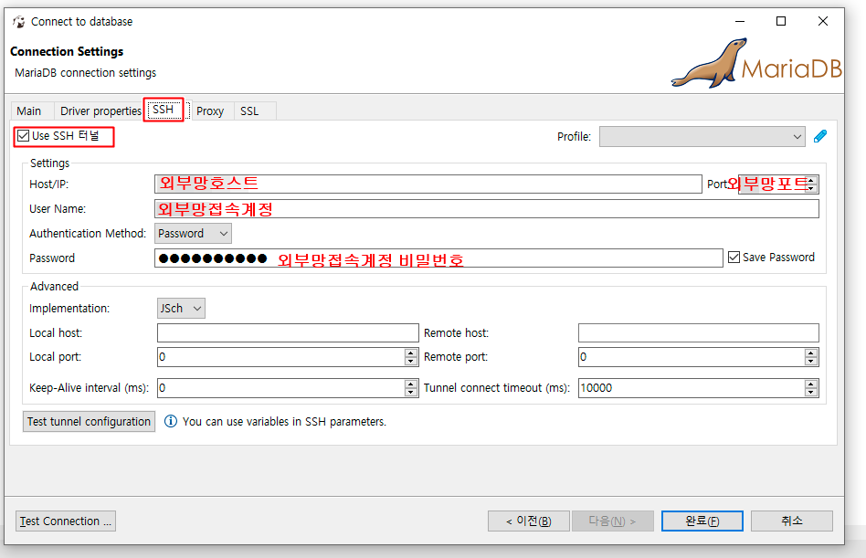

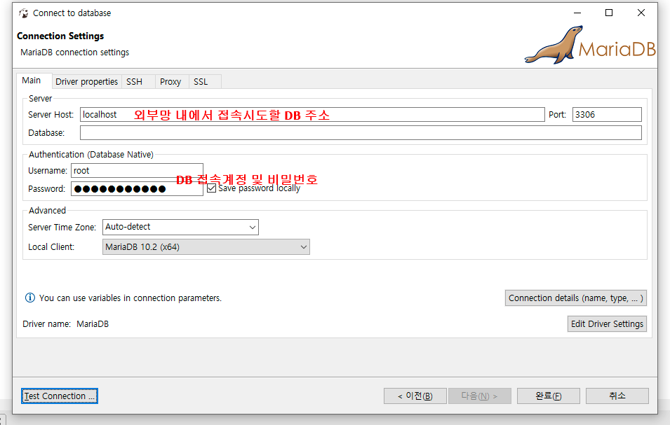

- 외부접근이 허용된 서버에 접속한 뒤, 해당 서버에 설치된 DB에 localhost:3306으로 접속