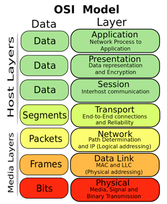

# 개요

- 일하면서 알아두면 좋을 네트워크 관련 지식들을 적어둠

# OSI 7

## 7 계층: 응용 계층(Application Layer)

- 사용자가 네트워크에 접근할 수 있도록 해주는 계층. 사용자에게 보이는 부분으로 서비스를 제공하는 사용자 프로그램을 말한다.
    - 프로토콜: DHCP, HTTP, DNS, FTP, SMTP 등

## 6 계층: 표현 계층(Presentation Layer)

- 시스템 간의 데이터 형식상 차이를 다루는 계층. 데이터 표현 양식 제공, 데이터 형태(구조) 통일화/변환(Big/Small Radian, 확장자, 암호화, 압축, 인코딩 등)
    - 프로토콜: JPEG, MPEG, AFP, MIME 등

## 5 계층: 세션 계층(Session Layer)

- 종단 간의 응용 프로세스가 통신을 관리하는 계층. 응용프로그램 또는 네트워크 간에 연결을 맺거나 끊기, 연결을 유지하는 기능을 담당하고, 포트(Port) 연결이라고도 한다.
    - 프로토콜: SSH, TLS, RPC 등

## 4계층: 전송 계층(Transport Layer)

- 종단 간의 통신(End to End)을 제어하는 계층. 데이터 전송의 신뢰성을 보장. 에러 제어, 혼잡 제어, 흐름 제어.
    - 프로토콜:  TCP, UDP 등

## 3계층: 네트워크 계층(Network Layer)

- 논리적 주소(IP주소)를 기반으로 출발지에서 목적지까지 가는 데이터 경로를 제어하는 계층. Path Selection, Routing을 하게 된다.
  - 프로토콜: IP, ICMP 등

## 2계층: 데이터 링크 계층(Data link Layer)

- 물리적 주소(MAC 주소)를 기반으로 노드 대 노드(Point-to-Point)로 데이터 전송 형태를 결정하는 계층. 기기간 처리. Error Control(물리계층에서 발생하는 Error), Flow Control(Ex> 스케줄링).
    - 프로토콜: Ethernet, PPP 등

## 1계층: 물리 계층(Physical Layer)

- 전기적인 접속. 통신 매체에 접근하는데 필요한 기계적이고 전기적인 기능과 절차를 규정한다.
    - 케이블, Voltage 등

# 망 범위

- 외부망 > 사설망 > 도커망 

# 포트 포워딩

# 참고

- [OSI 7 Layers](https://yoonix.tistory.com/10)