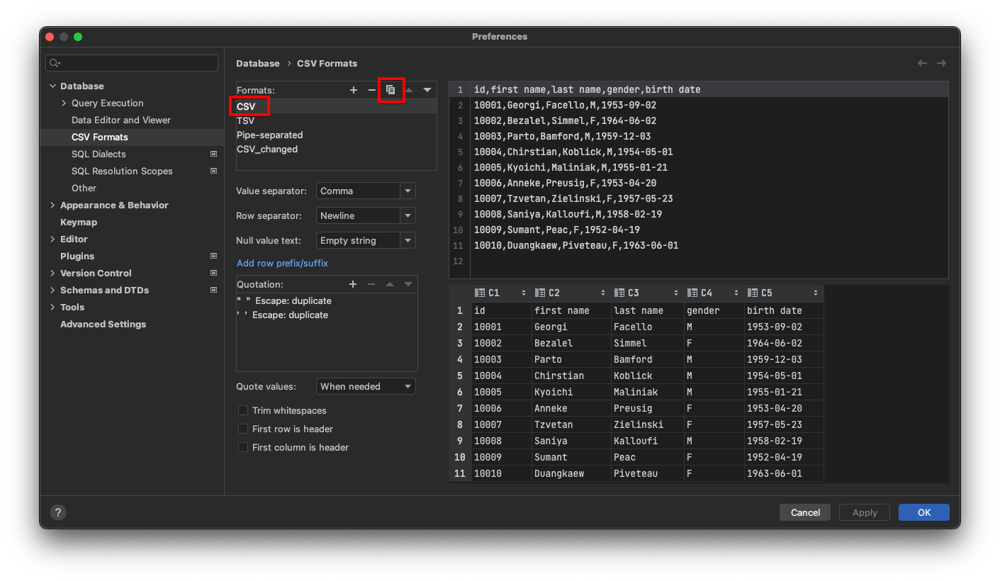
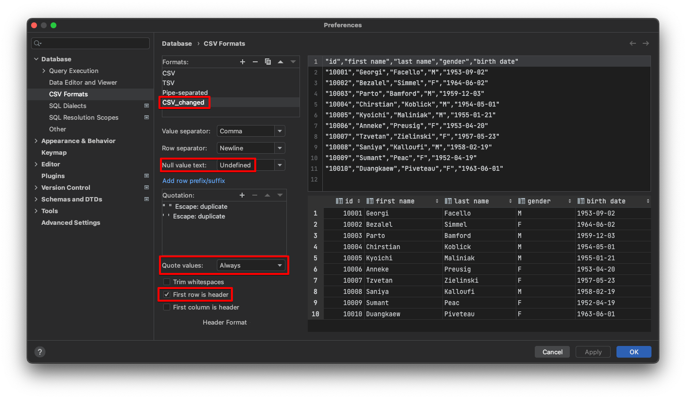
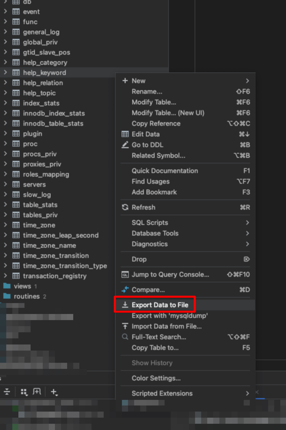
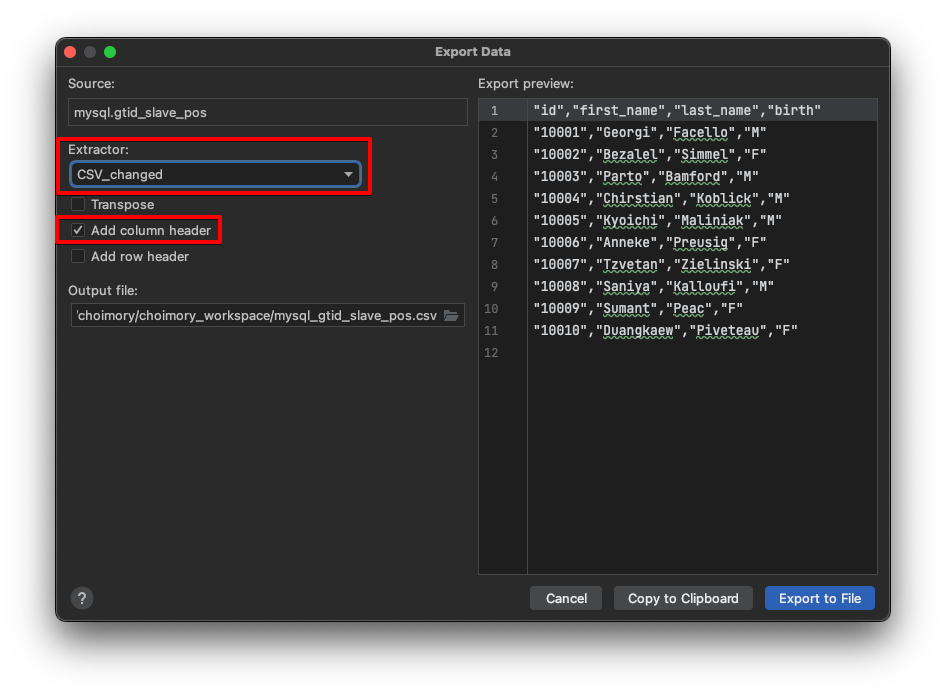
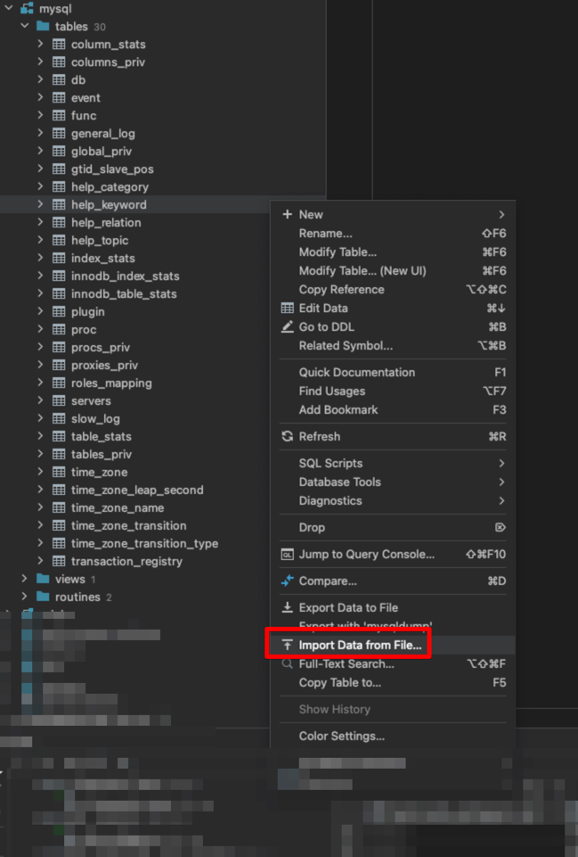
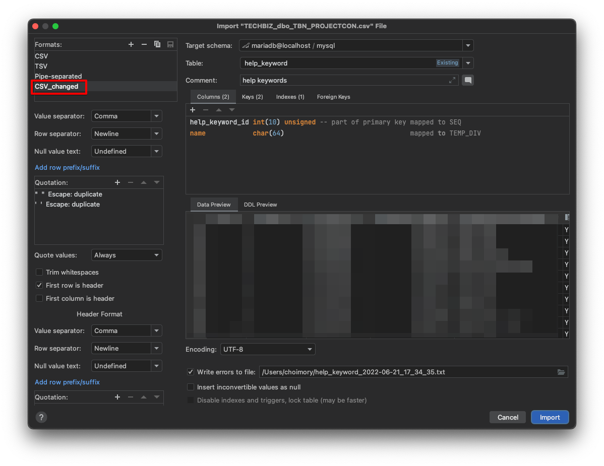

# 개요

- 데이터를 이관하다 보면 CSV로 데이터를 Export, Import 하는 경우가 많은데 해당 방법에 대해 알아보자.

# Preference CSV 포맷 설정

- `cmd+,`로 설정 진입 후, csv formats 검색
- CSV 포맷 선택 후 Copy 아이콘 클릭하여 템플릿 카피

- Null value text: empty string, undefined 중에 선택하는데, undefined를 권장한다. 
  - empty string은 숫자 컬럼이 값이 없을경우 ""로 저장되는데 이걸 다시 숫자로 저장하려고 할 시 형변환 오류가 날 수 있다.
- Quote values: when needed는 장문의 텍스트나 특문이 포함된 텍스트를 감싸주는데, 예외적으로 감싸주지 못하는 상황도 나오기 때문에 always로 바꿔주는게 좋음. 

# Export

- 설정한 템플릿을 지정 후, 컬럼 헤더 추가해서 export

# Import

- 설정한 템플릿 지정 후, import
  - 단 export한 csv가 해당 템플릿으로 export한 csv일시