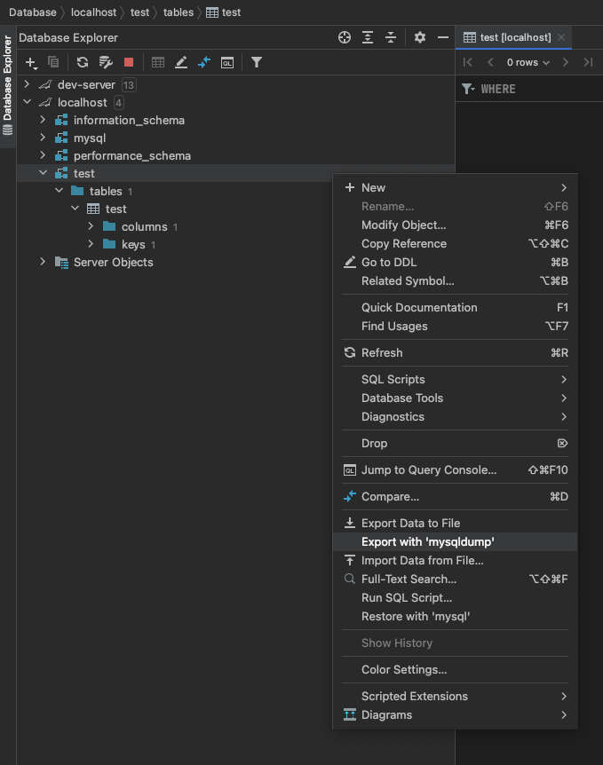
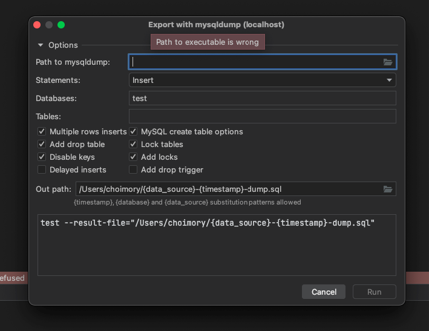
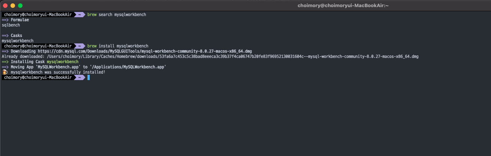
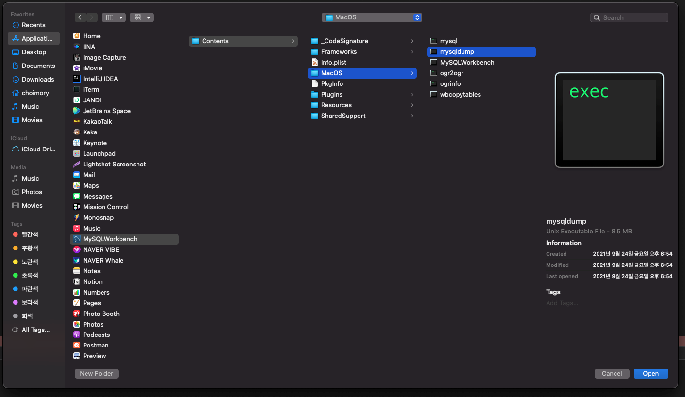
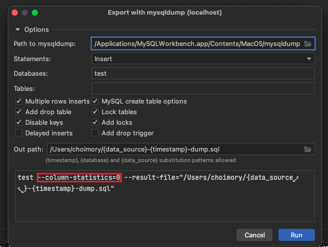

# 개요

- Datagrip으로 Mariadb 컨테이너의 DB를 mysqldump로 dump하려 하는데 mysqldump 파일을 찾지 못함
- mysqldump로 dump하려면 mysqldump 파일이 필요함
- mysqldump는 mysqlworkbench를 설치하면 획득할 수 있음
    - 윈도우는 mysql, mariadb에 mysqldump가 포함되어 있으나, mac의 경우 mysql 혹은 mariadb 설치한다고 mysqldump가 포함되어 있지 않음

# 이슈사항

- dump에 사용할 mysqldump의 경로를 찾을 수 없다고 함

# mysqlworkbench 설치

- `brew install mysqlworkbench`
- 윈도우와 달리 맥은 mysql이나 mariadb 자체를 설치한다고 mysqldump가 포함되어 있는건 아니기 때문에 mysqldump가 포함되어 있는 mysqlworkbench 툴을 설치해줌

# datagrip에서 mysqldump 경로 지정

- `/Applications/MySQLWorkbench.app/Contents/MacOS/mysqldump`

# 옵션 추가

- mysqldump 명령어에 **`--column-statistics=0`**옵션을 추가해주어야 함