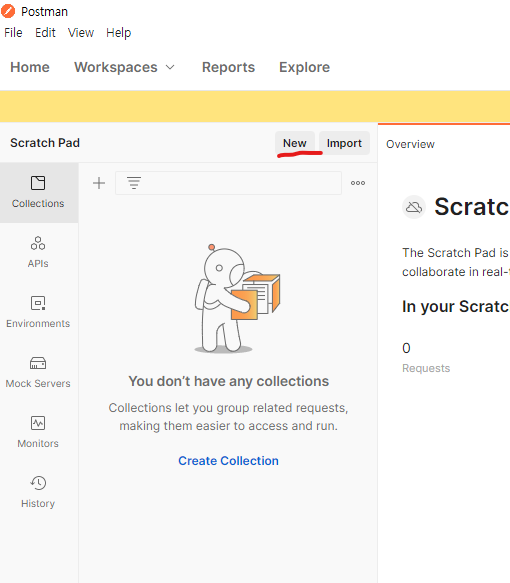
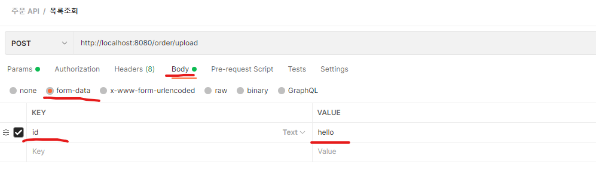
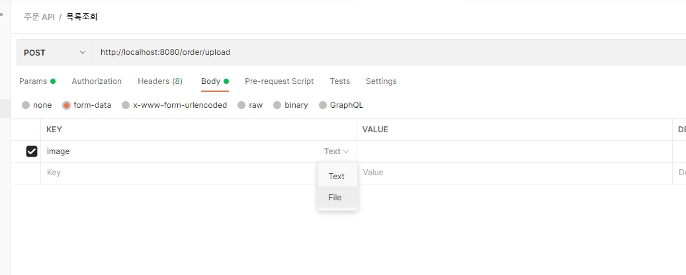
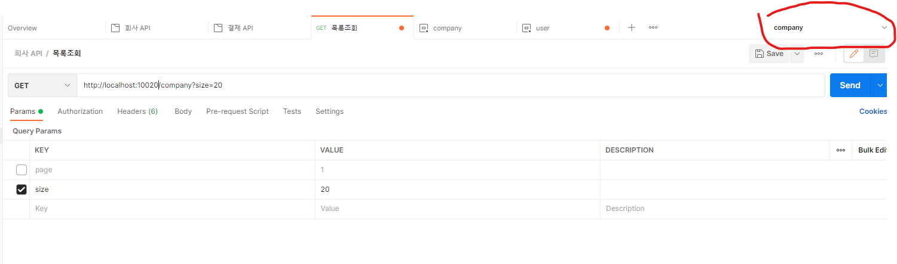

# 개요

- Postman은 특정 주소에 다양한 방법으로 http request 및 response를 확인할 수 있는 툴이다
- 요청 내용들을 저장할 수 있다
- 계정 동기화를 제공한다
- 그 외 잘 알지못하는 기능까지 매우 다양한 기능을 제공함

# Collection

> 많은 Http Request들을 Collection별로 나누어 분류할 수 있게함

- New 선택

- Collection 선택

- 새로 생성된 Collection에서 원하는 이름 작성 후 확인

# Request

- 추가할 Collection 우클릭 후 Add Request

1. HTTP Request 저장명 작성
2. HTTP Request 방식 작성
3. 요청주소 설정
    - 서버주소의 경우 동적으로 변화시킬수 있는데 이는 Environment 항목에서 설명
4. 파라미터값은 GET의 경우 Params에서, 그 외 Request Body는 body에서 입력하게 됨

## GET Parameter 전송

1. 요청방식을 GET으로 설정
2. Params 선택 (GET param을 입력하는곳)
3. 3번항목에 Parameter 작성시 요청주소에 추가됨

## form Parameter 및 첨부파일 전송

### 일반 텍스트

- body → form-data → key,value 입력

### 첨부파일

- key의 type을 file로 변경

- 업로드파일 선택

## Json Parameter 전송

1. Body선택
2. Raw 선택
3. Type을 Json으로 변경
4. Request Body를 Json 구조로 작성

## Authorization 설정

> Basic auth, OAuth2.0, AWS Signature, API Key 등 각종 인증을 포함한 전송을 해야할때

- Authorization에서 필요로하는 방식 선택

### API Key

- 공공기관 오픈 API 등 외부 API 요청시 발급받은 key를 함께 요구하는 경우가 있음. 그때 사용하게 되었음
- API Key 선택하여 K,V 입력후  요청 헤더 혹은 URI 중 포함될 곳 선택

### Basic Auth

- ES Cloud 통신시 Basic Auth를 요구하게 되어 사용하게 되었음
- Basic Auth 선택 후 계정정보 입력하면 됨

# Environment

> 같은 API라도 개발서버에 요청해야 할수도, 운영서버에 요청해야 할수도, 로컬에 요청해야 할수도 있어 주소가 계속 달라질 수 있다.
이때 Environment로 서버주소를 동적으로 쉽게 바꿀수 있다

- New → Environment 선택

- 해당 API가 사용되는 서버들을 하나의 Environment에 작성하여 API별로 Environment를 분류하면 좋다
1. Environment : Postman에서 사용될 Environment 이름
2. Variable : 주소부분에 동적으로 들어가게 매핑할 변수명
3. Value : 들어갈 값

- API 요청 전 사용할 Environment 선택

- 주소부분을 선택한 Environment의 {{Variable명}}으로 바꾼다
- 예시로 작성한 company라는 Environment는 세가지 변수명이 있다
    - local, dev, aws
    - 고로 {{var}} 부분에 local을 넣어주면 local이라는 변수명에 매핑한 값(http://localhost:10020)이 들어가고, aws를 넣어주면 aws라는 변수명에 매핑한 값(https://aws.ec2.....)가 들어가게 됨