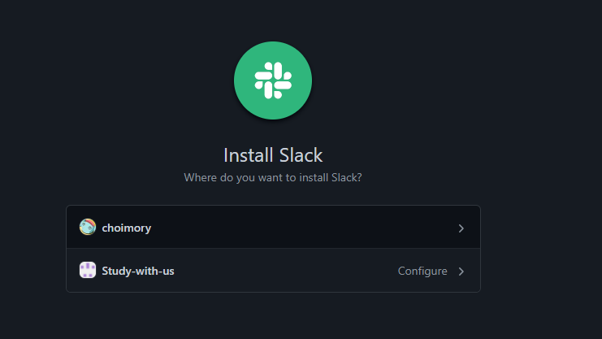

# 개요

- Slack과 Github을 Integration하여 Repository 변경사항 알림을 Slack으로 받아보자

# 플러그인 설치

# Github 앱 채널에서 명령어 입력

- `/github subscribe 사용자명/저장소명` 혹은 `/github subscribe organization명/저장소명`

- 깃헙 계정 연결

- 받은 코드 입력

- 연동할 계정 혹은 organization과 저장소 선택