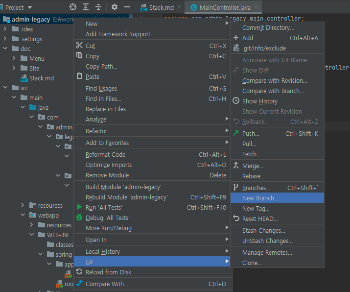
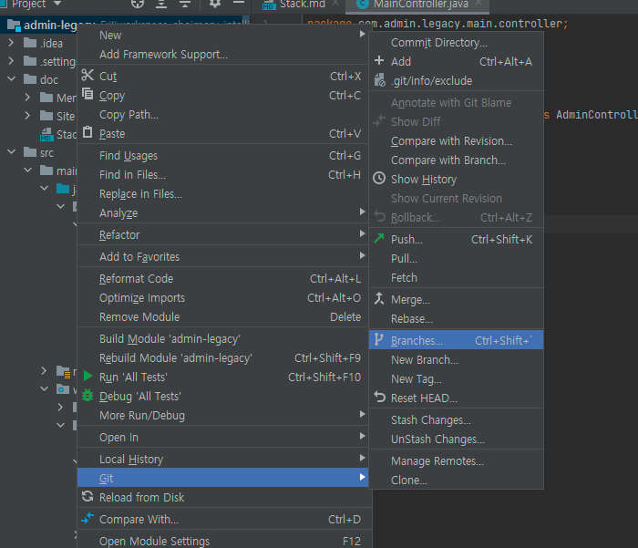
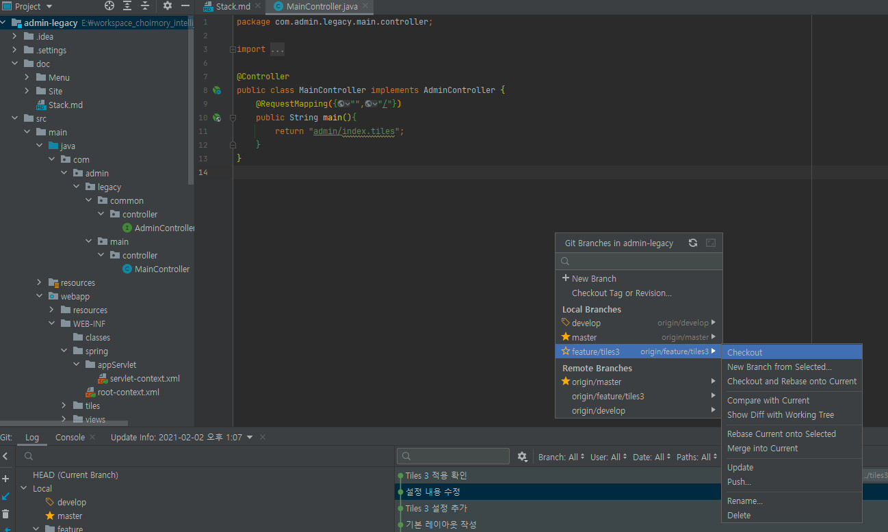

# 브랜치 생성

# 브랜치 변경

- 변경할 로컬 저장소 혹은 원격 저장소의 브랜치의 체크아웃 선택

# 주요 브랜치

## master (main)

- 실제 운영되는 브랜치

## develop

- 개발 브랜치.
- master 브랜치에서 분기해서 작업
- feature 브랜치들의 작업사항들을 모두 merge 해서 받아놓는곳

## feature/*name*

- 개발 기능별 브랜치
- develop에서 분기하여 작업
- 기능단위로 생성함
- feature/login, feature/query_tunning...
- 기능 구현 완료 후 develop 브랜치에 merge 해주고 삭제
- feature 브랜치는 다른 feature의 변경사항을 merge할 필요가 없음. feature에서의 변경사항을 모두 merge해주는곳은 develop 브랜치

## release-*version*

- 배포 준비를 위한 브랜치
- develop → master로 바로 배포할 수 도 있지만, develop→release→master로 배포할 수 도 있음
    - 이때 release는 master와 develop 모두 merge함
- 뒤에 버전을 적음
- release-1.13....

## hotfix-*version*

- master에 배포하였는데 문제가 생겼을시, master에서 hotfix 브랜치를 따서 작업 후 master에 바로 merge한다
- hotfix 브랜치만 master에서 바로 브랜치를 만들 수 있다