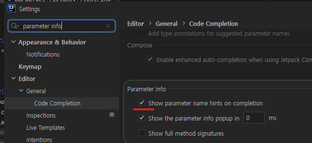

# 개요

- 메소드 호출시 파라미터 종류와 이름 등 간략 정보를 팝업으로 바로 볼수 있도록 하는 설정

# 방법

- Preference

- parameter info 검색하여 사진의 해당부분을 1000ms를 보다 짧게 설정

- 이런식으로 위에 파라미터 정보 팝업이 뜨게됨

- 참고로 위의 체크박스 체크시에는

- 입력자리에 변수명 태그가 같이 표시됨