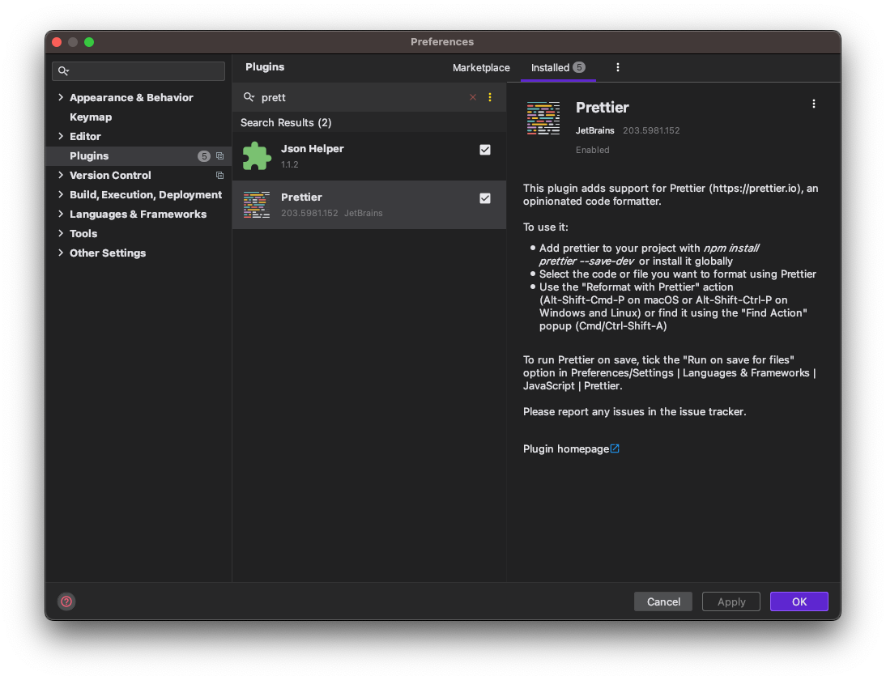
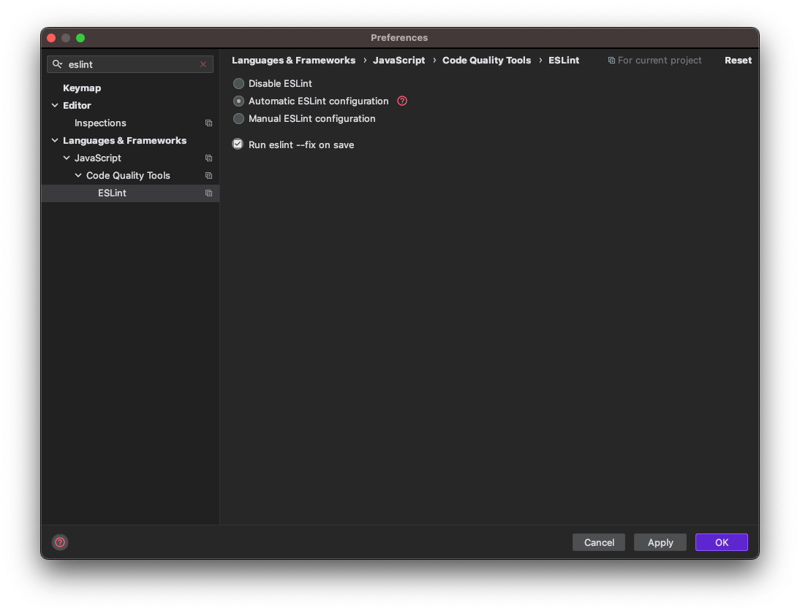

# eslint란?

- JS 코드 컨벤션을 맞춰주는 linter이다
- 프로젝트 내부의 eslint 설정 파일대로 동작하게 됨

# eslint 설치

```shell
npm install --save-dev eslint@7
```

- eslint 버전에 따라 오류가 발생 할 수 있다. 필자는 해당문제로 eslint@8을 7으로 다운그레이드 하여 적용함
- `--save-dev`는 배포가 아닌 개발에만 패키지가 적용되도록 하는것으로, 해당 플래그로 설치시, package.json의 dependencies에서는 제외되고 devDependencies에만 추가된다

# prettier 설치



- IntelliJ plugin으로 IDE 글로벌 설치를 진행
- 해당 프로젝트에만 적용시 `npm install --save-dev prettier`

# 설정



- preference -> eslint 검색 -> auto config 선택 -> run eslint --fix on save에 체크

# 참고

- https://jojoldu.tistory.com/230
- https://stackoverflow.com/questions/57944468/webstorm-2018-1-4-eslint-typeerror-this-cliengine-is-not-a-constructor