# 개요

- Github 개인 Repository는, OAuth 로그인만으로 접근이 가능하다.
- 하지만 Gituhb Organization의 private Repository들은, OAuth 로그인으로는 접근이 불가능하고, Token을 생성하여 접근해야만 접근이 가능하다.

# Github Organization Repository 목록 연동하기

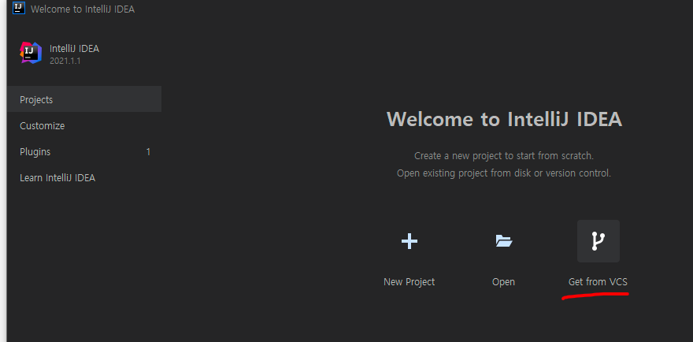

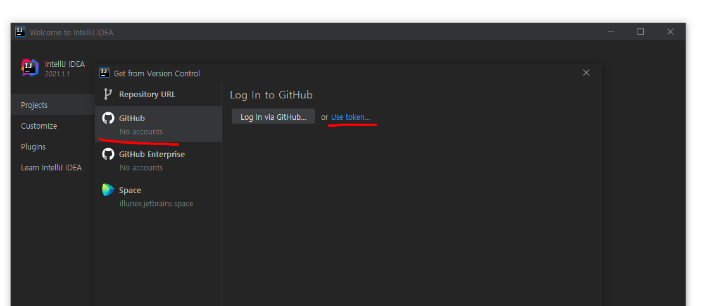

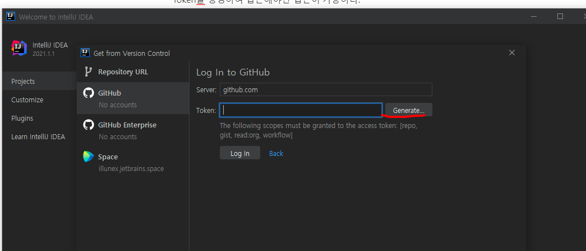

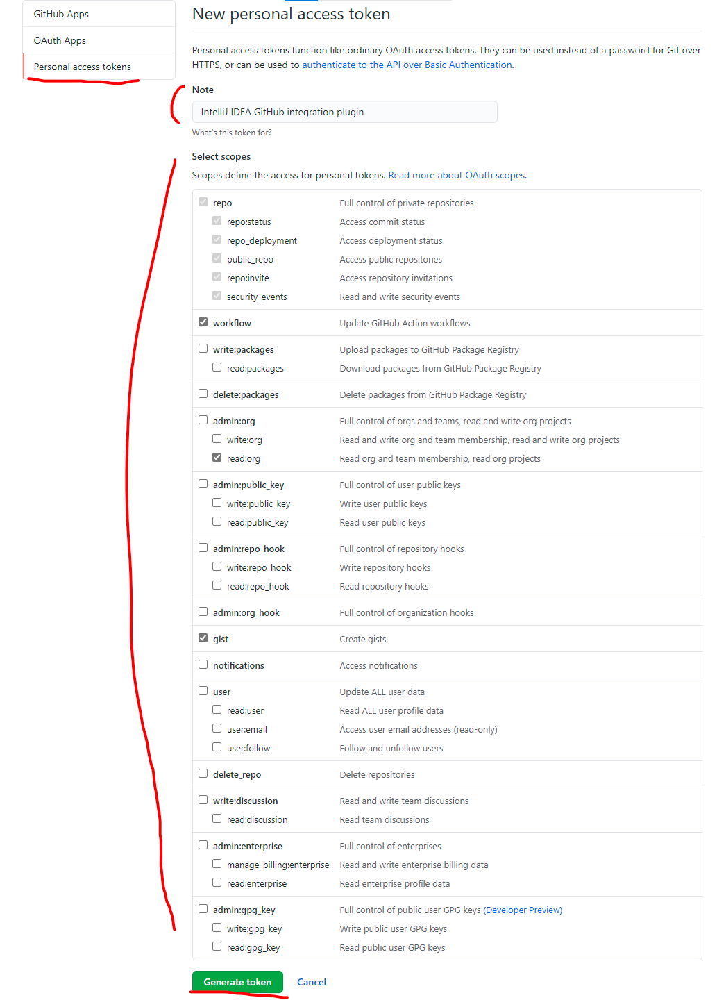

- IntelliJ를 통해 리다이렉트되어 접속했을시, Token 이름과 IntelliJ 연동에 필요한 항목들이 자동 체크되어 있음.

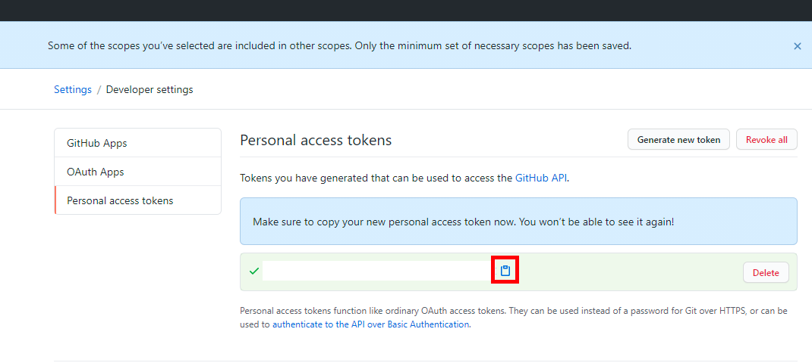

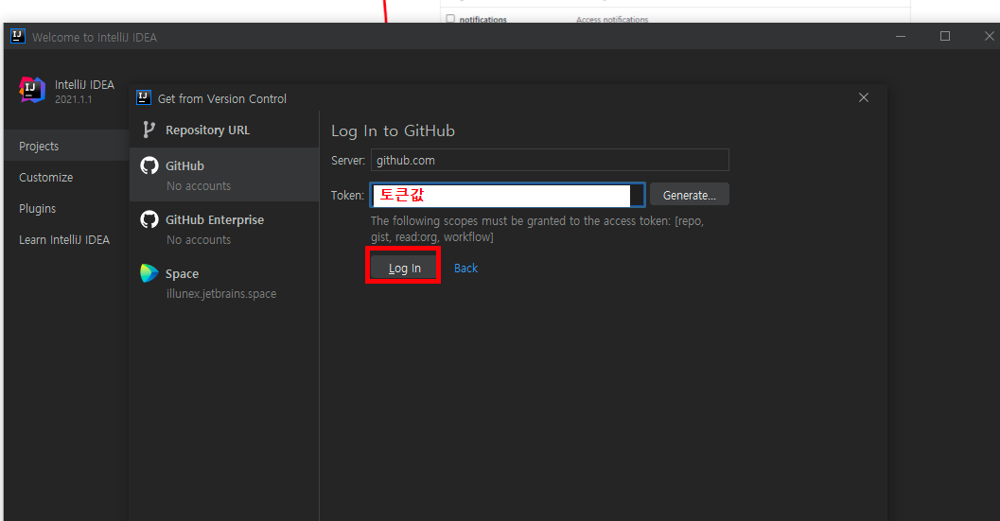

# 하나의 Repository만 Clone할 경우

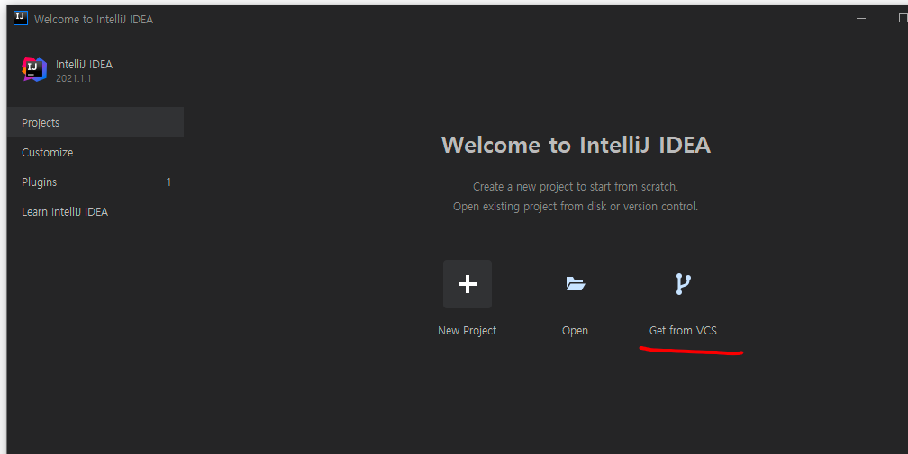

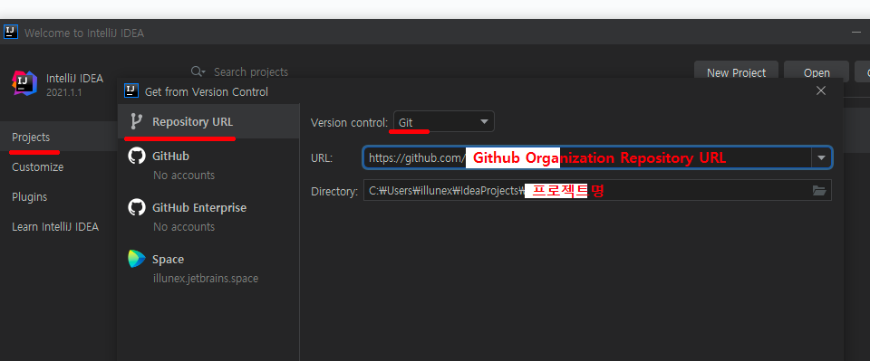

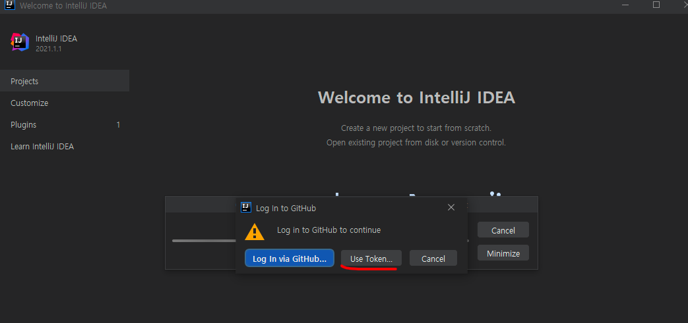

- 로그인 OAuth로는 Github Organization private Repository를 이용할 수 없음.
- Token을 이용해야만 Clone이 가능함.

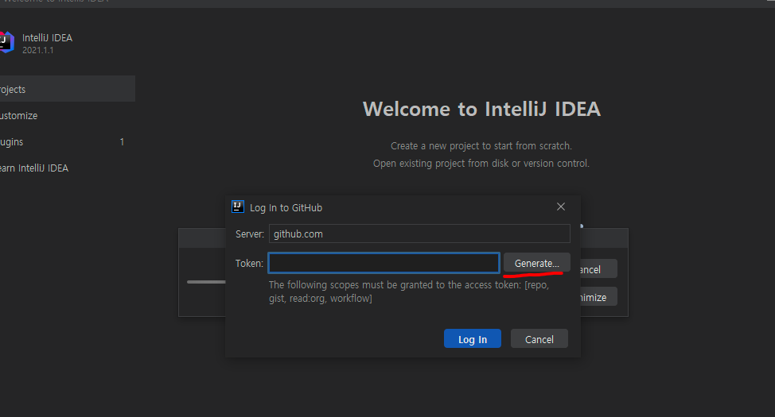

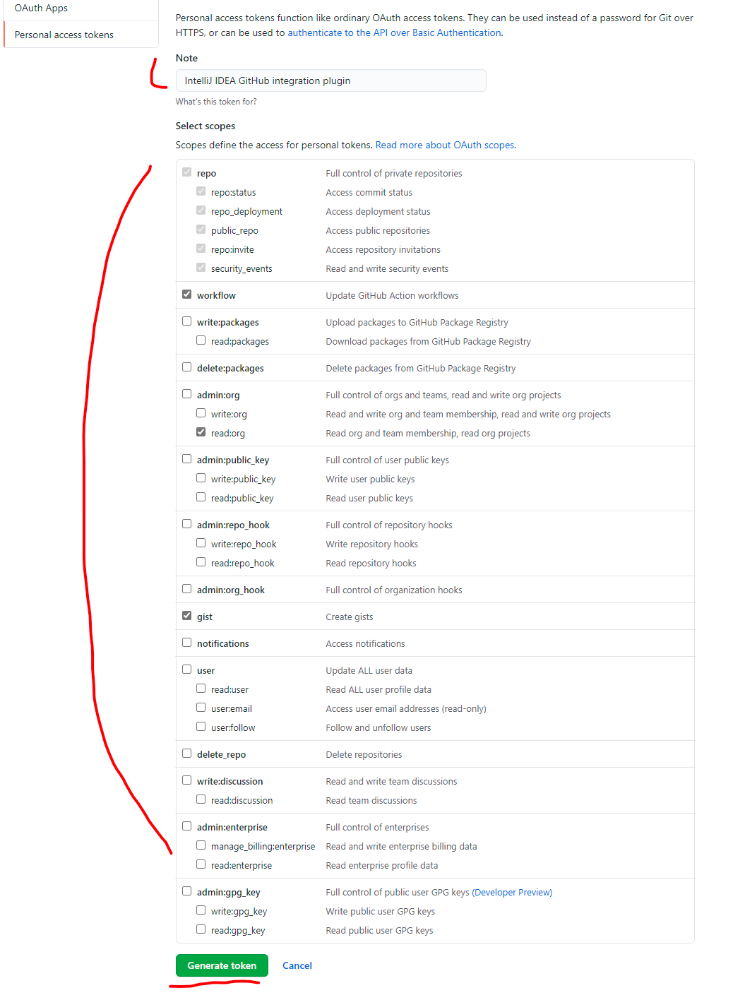

- IntelliJ를 통해 Token 생성 페이지로 리다이렉트시, 생성할 Token 이름과 필요한 항목들이 자동 체크되어 있음

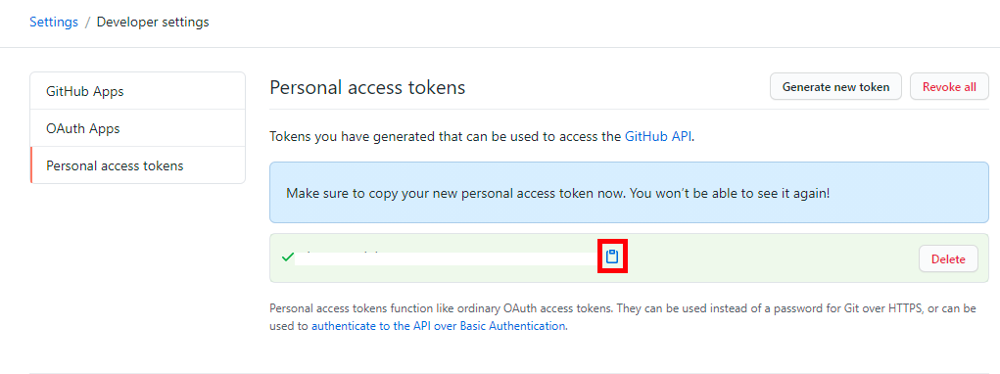

- 방금 만든 토큰값 복사

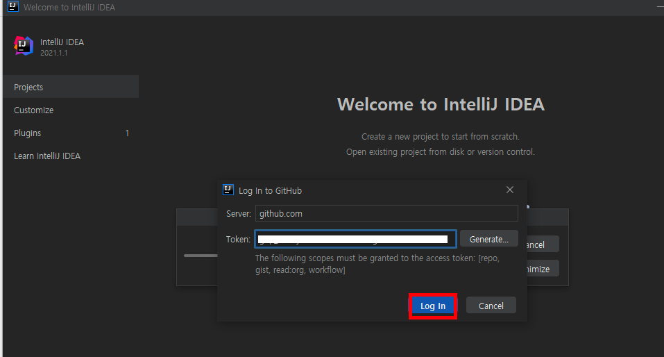

- 로그인버튼 누름으로써, Clone되어 프로젝트 생성됨.
- 또한 Github항목에서 볼 수 있는 Repository의 목록에 Organization의 Repository들도 목록에 추가되어 있음.