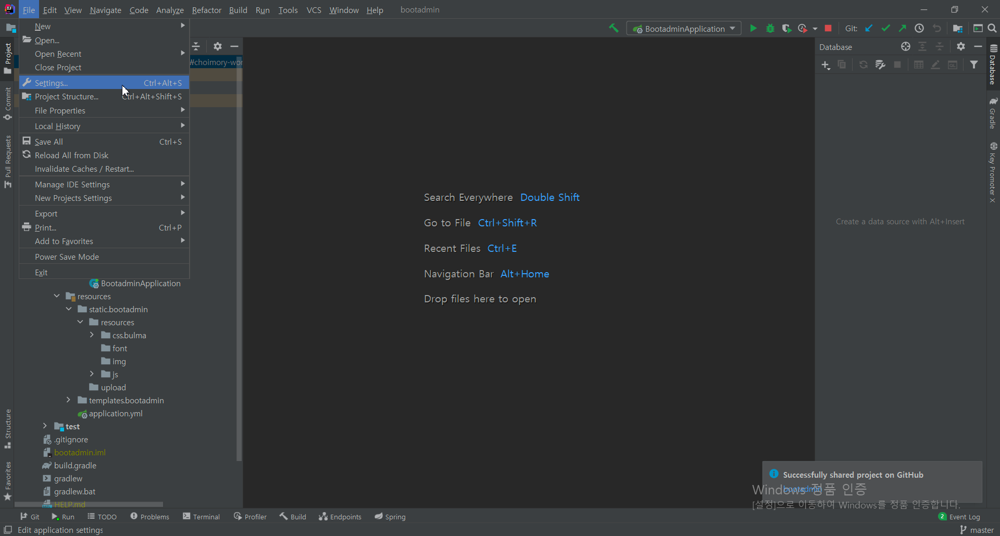
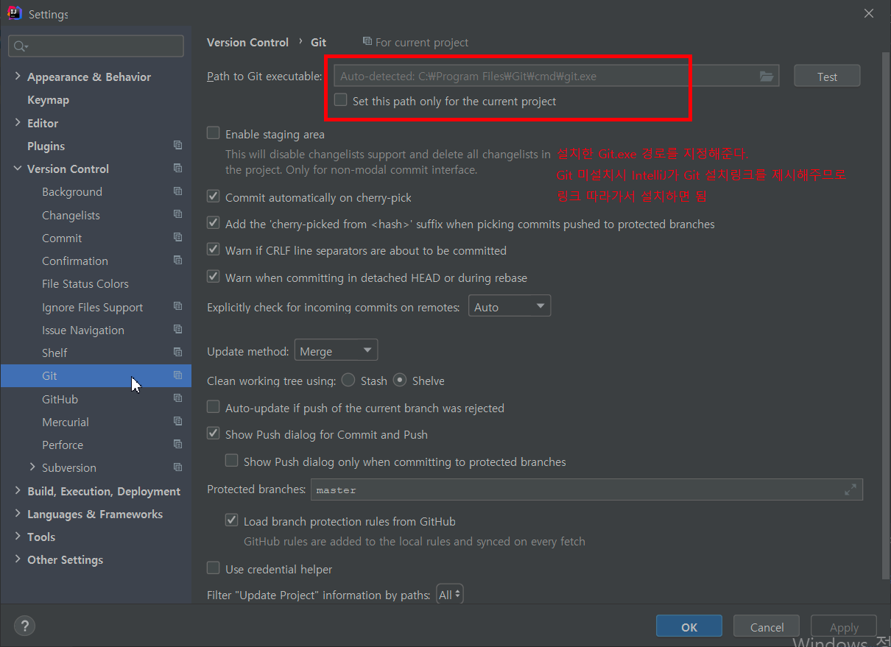
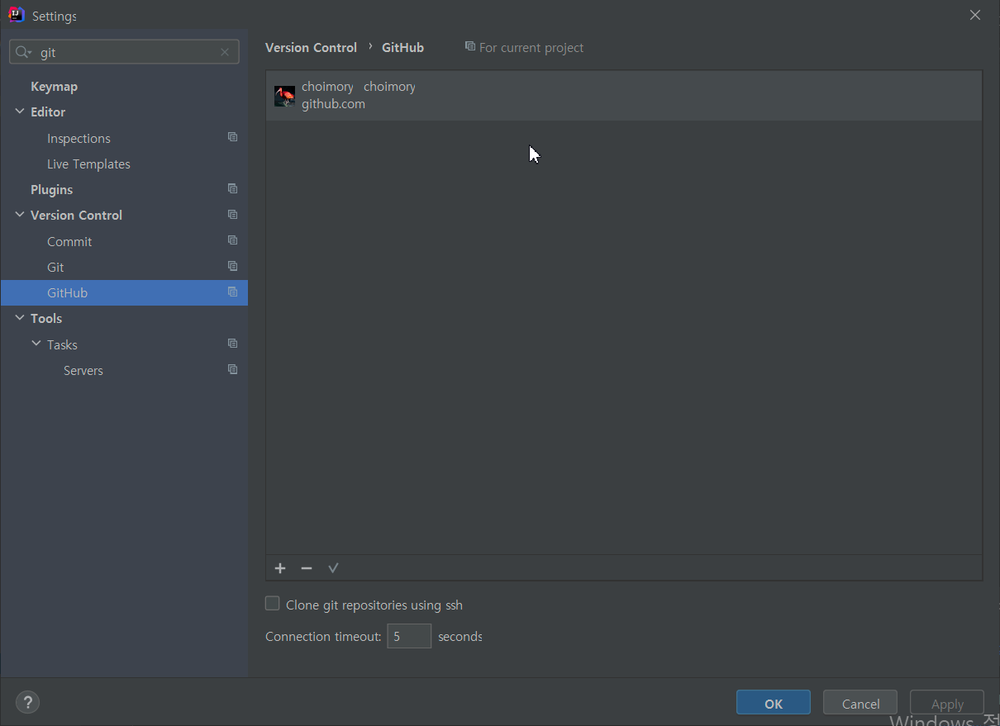
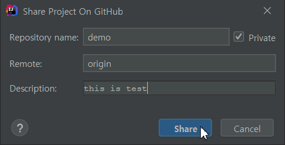
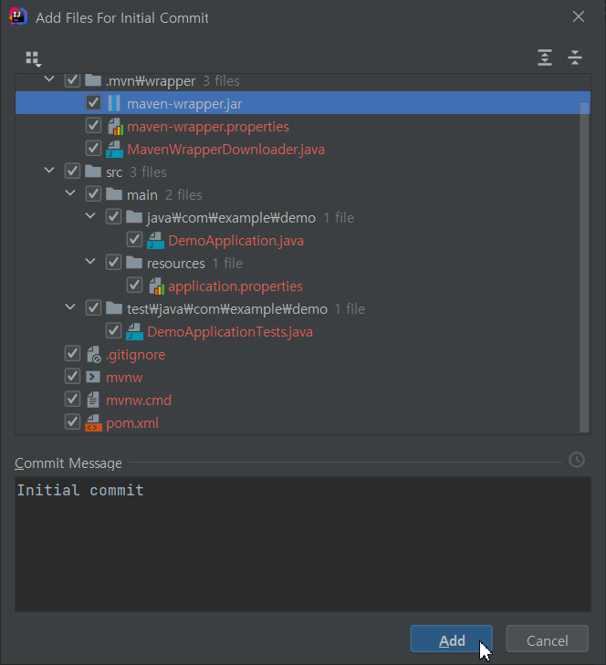
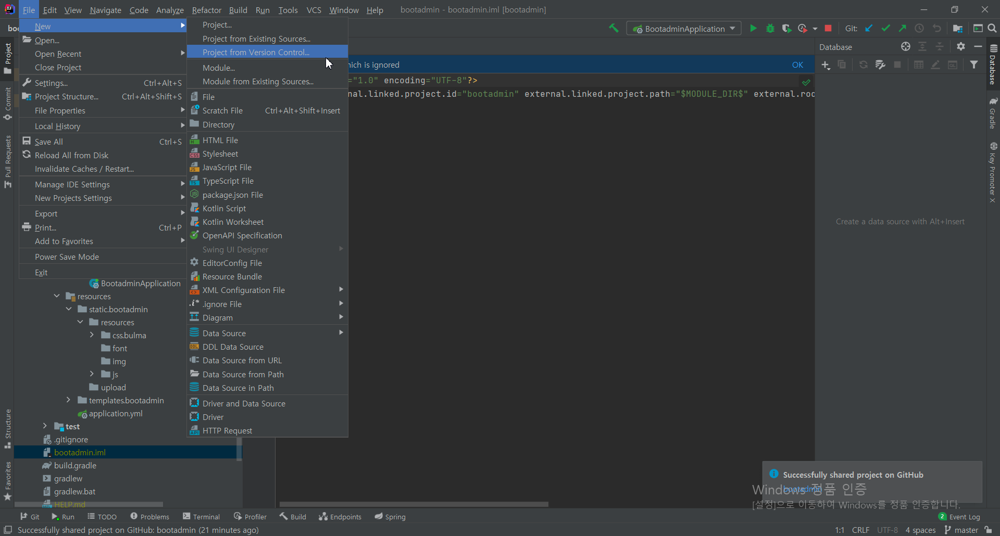
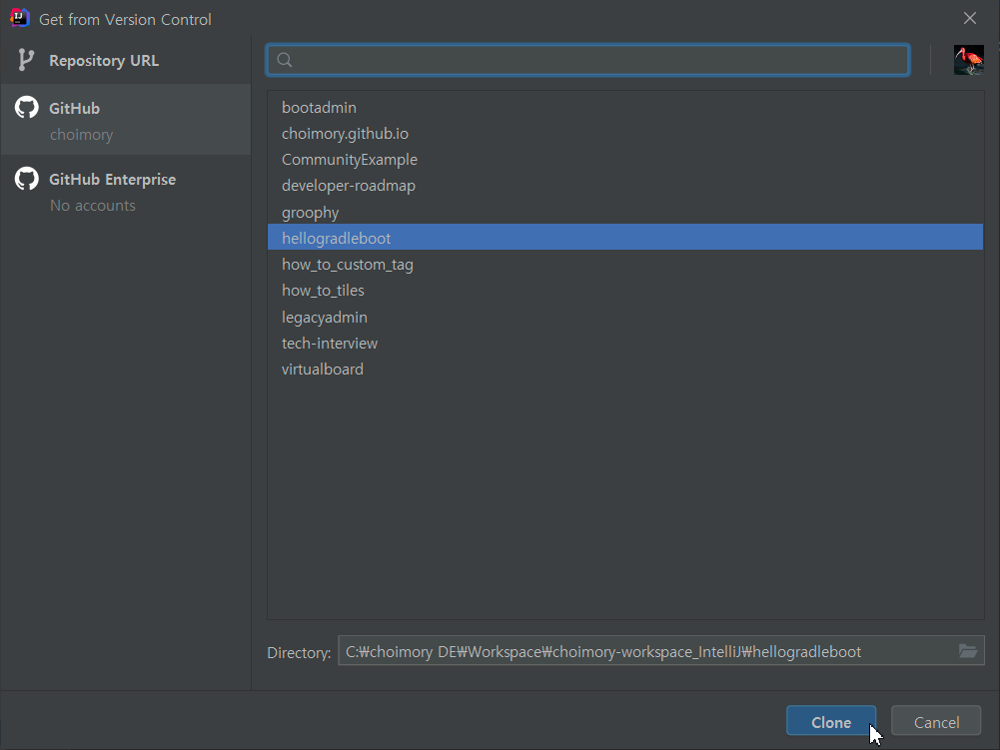
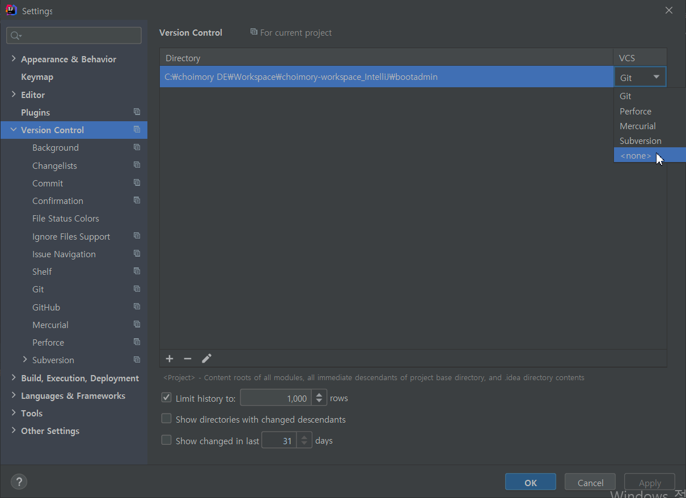
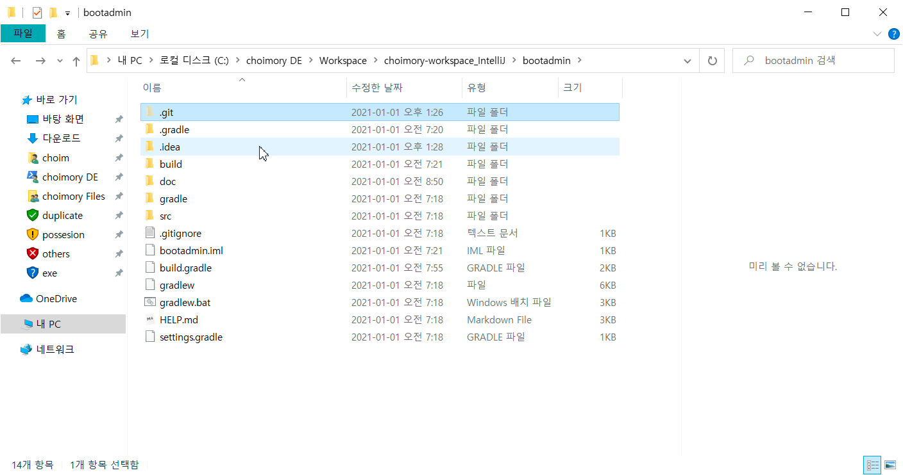

# 개요

- IntelliJ에서는 Eclipse와는 비교도 불허할 정도로 아주 편리하게 Github을 이용한 버전관리가 가능함.
- 반드시 Clone할 필요 없이 IntelliJ내에서 Github 리포지토리를 생성하여 임포트 할 수도 있음.

# 전제조건

Git을 설치 후 Github 아이디 로그인하여 연동해준다

# Import

로컬에서 작성한 프로젝트를 임포트 하고 싶을시엔  vcs → share project on github을 선택하여 진행한다.

# Clone (Checkout)

new project from vcs 이후 github 리포지토리에서 클론할 리포지토리를 선택해준다

# Pull

# Push & Commit

# Disconnect

IntelliJ의 File → Settings → Version Control에서 해당 프로젝트의 VCS를 none으로 변경하고, 프로젝트 내 숨김폴더 .git폴더 삭제