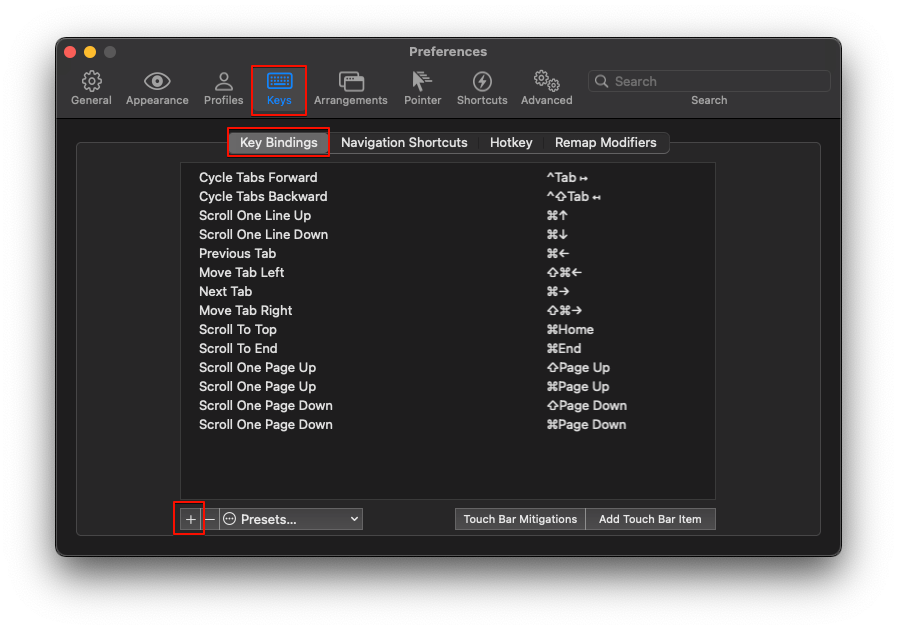

# 개요

- iTerm는 기본 zsh에 비해 확장성이 좋아 Mac진영의 주요 터미널 앱으로 사용되고 있음

# iTerm 설치

iTemrs2 설치에 앞서 zsh 설치가 선행되어야 한다, bigsur의 경우 기본 터미널앱이 zsh임

```bash
brew install iterm2
```

# Oh my zsh 설치

oh my zsh는 zsh를 더 쉽게 사용하게 해주는 플러그인임.

```bash
sh -c "$(curl -fsSL https://raw.github.com/robbyrussell/oh-my-zsh/master/tools/install.sh)"
```

# 테마 변경

홈 디렉토리의 `.zshrc`를 수정해준다. `.zshrc`는 zsh의 설정이 작성되어 있는 파일임.

```bash
vi ~/.zshrc
```


- `.zshrc`에서 ZSH_THEME 이라는 부분의 robyrussell를 agnoster라는 테마로 변경한다
- agnoster는 기본 설치 테마이므로 별도의 설치는 필요하지 않다

> vi 종료후 `source ~/.zshrc`로 변경사항을 불러와야 적용사항을 확인할 수 있다

# 폰트 변경

해당 테마는 디렉토리 표시에 특문이 사용되어 폰트가 깨져서 표시될 수 있다. 고로 특문이 지원되는 폰트로 변경한다

- [https://github.com/naver/d2codingfont](https://github.com/naver/d2codingfont)에서 네이버의 d2 coding을 다운로드


- 파일을 다운로드 한 뒤, 폰트 파일을 실행하여 서체설치시 Mac에 폰트를 설치 할 수 있음.


- iTerm2에서 `cmd+,`로 Preference에 진입하여 해당 항목에서 폰트를 변경하여 적용해준다

# 색상변경

원하는 색상을 사용하고 싶을때 색상 preset을 다운받아 적용할 수 있다

- curl설치

```bash
brew install curl
```

- [https://iterm2colorschemes.com/](https://iterm2colorschemes.com/)에서 원하는 색상 preset 클릭
    - 추천 color : espresso, adventure, after glow, authur, blazer, bultin pastel dark, bultin solarized dark, challenger deep, ciapre, doomone, fideloper, hacktober, iceberg
- curl을 이용하여 해당 색상 preset 코드를 다운로드

```bash
curl -LO https://raw.githubusercontent.com/mbadolato/iTerm2-Color-Schemes/master/schemes/Snazzy.itermcolors
```

- Preference에서 다운받은 색상 preset import후 적용


# homebrew 오류시

기존에 설치된 homebrew가 사용되지 않을시 .zshrc 하단부에 해당항목 작성 후 저장

- M1

```bash
eval $(/opt/homebrew/bin/brew shellenv)
```

- Intell

```bash
export PATH=/opt/homebrew/bin:$PATH
```

- 작성 후 `source ~/.zshrc`

# 유용한 플러그인 설치

## zsh-syntax-highlighting

```bash
git clone https://github.com/zsh-users/zsh-syntax-highlighting $ZSH_CUSTOM/plugins/zsh-syntax-highlighting
```

## zsh-autosuggestions

```bash
git clone https://github.com/zsh-users/zsh-autosuggestions $ZSH_CUSTOM/plugins/zsh-autosuggestions
```

## 설치한 플러그인들 적용

.zshrc에 해당 항목 추가 후, `source ~/.zshrc`

```bash
....
plugins=(
  git
  docker
  zsh-autosuggestions
  zsh-syntax-highlighting
	....
)
...
```

> homebrew로도 받을수는 있지만 brew로 설치시, 플러그인 경로가 zsh 플러그인 경로가 아닌 brew경로에 설치되므로 `$ZSH_CUSTOM/plugins/플러그인명` 경로로 이동시켜주어야함

# 단축키 설정

> 단어 삭제, 단어간 이동, 맨 앞/뒤로 이동 등의 단축키를 설정해준다

## 설정 진입



- `cmd+,`로 설정 진입 -> Keys -> key Bindings 진입 -> +키 눌러서 단축키 추가


- Click to Set을 눌러 원하는 단축키를 누른 후, Action에서 취할 행동을 선택해주면 끝

## 맨 앞/뒤로 이동


- 맨앞/뒤 이동은 `cmd+좌우방향키`로 지정해주자
- 취할 액션은 Send Escape Sequence
  - OH(좌), OF(우)

## 단어간 이동


- 단어간 이동은 `opt+좌우방향키`로 지정해주자
- 취할 액션은 Send Escape Sequence
  - b(좌), f(우)
  


- 단 `opt+좌우방향키`는 이미 글로벌 단축키로 지정된게 있으므로 제거해주자.
  - `cmd+,`로 설정 진입 -> Profiles -> Keys -> Key Mappings 진입 후 `opt + 좌,우` 에 해당하는 단축키 제거

## 단어 삭제


## 라인 삭제


# 참고

- [https://velog.io/@mook9288/macRecord-005](https://velog.io/@mook9288/macRecord-005)
- [https://ooeunz.tistory.com/21](https://ooeunz.tistory.com/21)
- [https://medium.com/harrythegreat/oh-my-zsh-iterm2로-터미널을-더-강력하게-a105f2c01bec](https://medium.com/harrythegreat/oh-my-zsh-iterm2%EB%A1%9C-%ED%84%B0%EB%AF%B8%EB%84%90%EC%9D%84-%EB%8D%94-%EA%B0%95%EB%A0%A5%ED%95%98%EA%B2%8C-a105f2c01bec)
- [https://im-nc2u.tistory.com/entry/zsh-와-ohmyzsh-로-터미널-업그레이드하기](https://im-nc2u.tistory.com/entry/zsh-%EC%99%80-ohmyzsh-%EB%A1%9C-%ED%84%B0%EB%AF%B8%EB%84%90-%EC%97%85%EA%B7%B8%EB%A0%88%EC%9D%B4%EB%93%9C%ED%95%98%EA%B8%B0)
- [https://ehdals9412.tistory.com/27](https://ehdals9412.tistory.com/27)
- [iterm 단축키 설정](https://minny27.tistory.com/49)