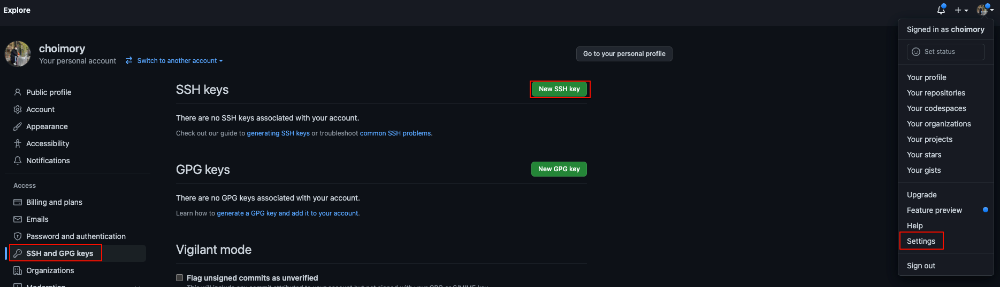
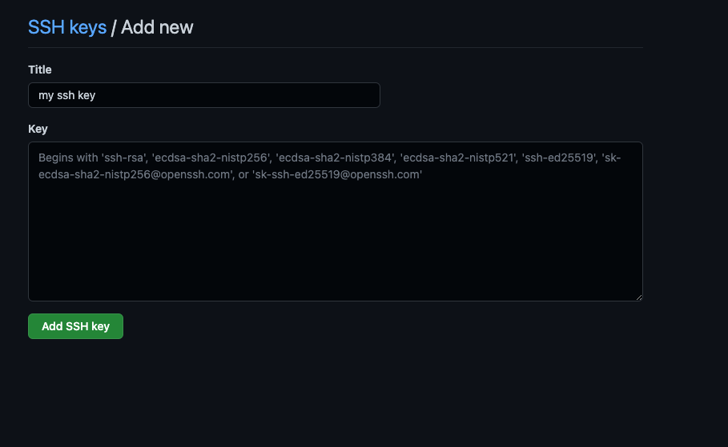

# 요약

- 생성된 키를 ~/.ssh/id_rsa, id_rsa.pub으로 내려놓는다
- 키를 계정에 등록한다
- `git clone git@github.com:[user_name 혹은 organization_name]/[repo_name].git`으로 클론한다

# 키 설정

```shell
# 생성
ssh-keygen -t rsa

# 시스템 기본키로 설정
mv [공개키.pub] ~/.ssh/id_rsa.pub
mv [프라이빗키] ~/.ssh/id_rsa

# 권한변경
chmod 600 ~/.ssh/id_rsa.pub ~/.ssh/id_rsa
```

- 키가 없다면 키를 생성해주고 시스템 기본키로 등록해준다

# github 계정에 ssh key 등록하기



- Settings - SSH and GPG Keys - new SSH Key 진입
    - [https://github.com/settings/ssh/new](https://github.com/settings/ssh/new)


    
- 제목에는 원하는 키 이름, 본문에는 `more ~/.ssh/id_rsa.pub`으로 공개키 조회하여 나온 내용을 입력해주고 확인하여 등록

# 클론

- 클론을 원하는 디렉토리에서 `git clone git@github.com:[user_name 혹은 organization_name]/[repo_name].git`