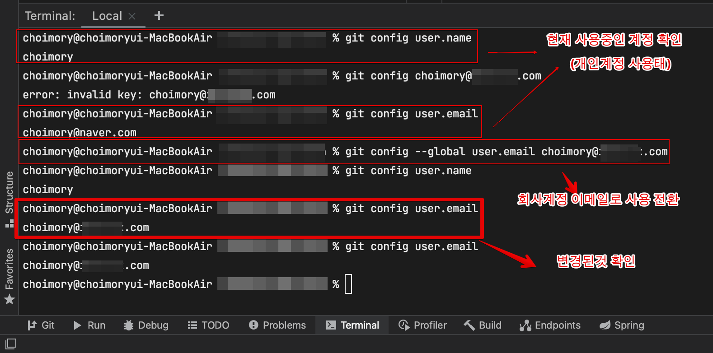

# 개요

- 개인 환경에서 개인계정, 회사계정을 병행해 개인 프로젝트와 회사 프로젝트를 작성하는데, 회사 프로젝트를 개인계정으로 커밋하고 개인 프로젝트를 회사계정으로 커밋하거나 할때 올바른 계정을 물려서 작업 진행하는 법을 알아봄

# 현재 연동된 깃헙계정확인

- 사용자명 확인: `git config user.name`
- 이메일 확인: `git config user.email`

# 변경

- 사용자명을 이용해 변경: `git config --global user.name 사용자명`
- 이메일을 이용해 변경: `git config --global user.email 이메일`
- `--global` 옵션
    - `--global`적용시 모든 프로젝트 전체적용, 제외시 해당 프로젝트에만 적용

이후 다시 확인해보면 변경 확인