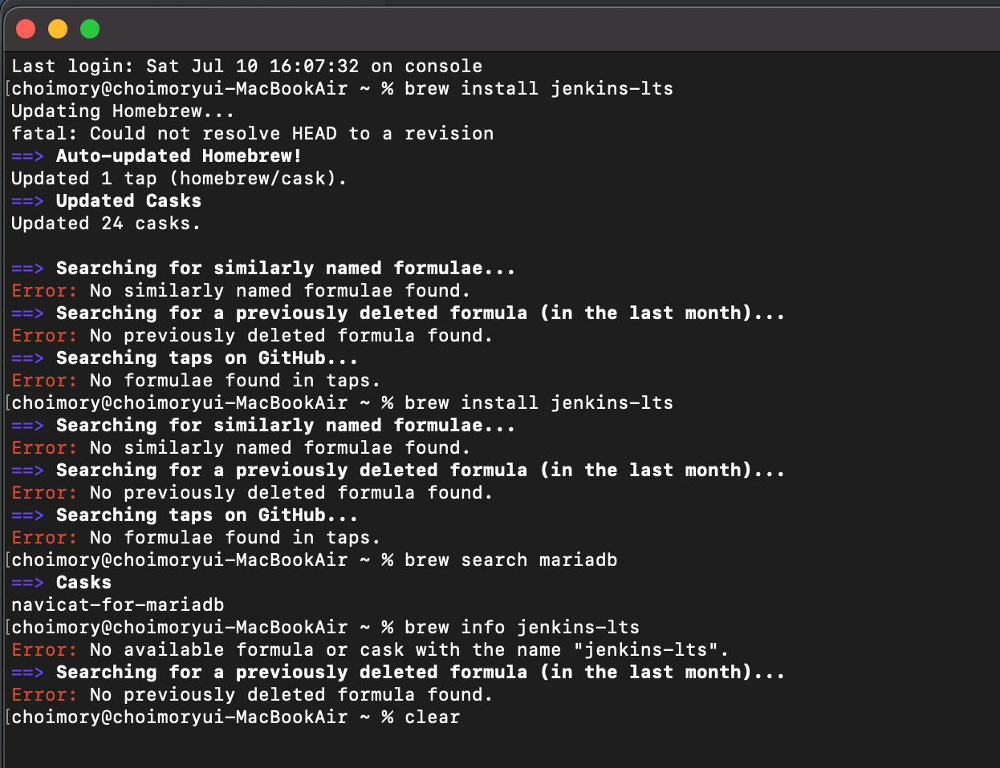
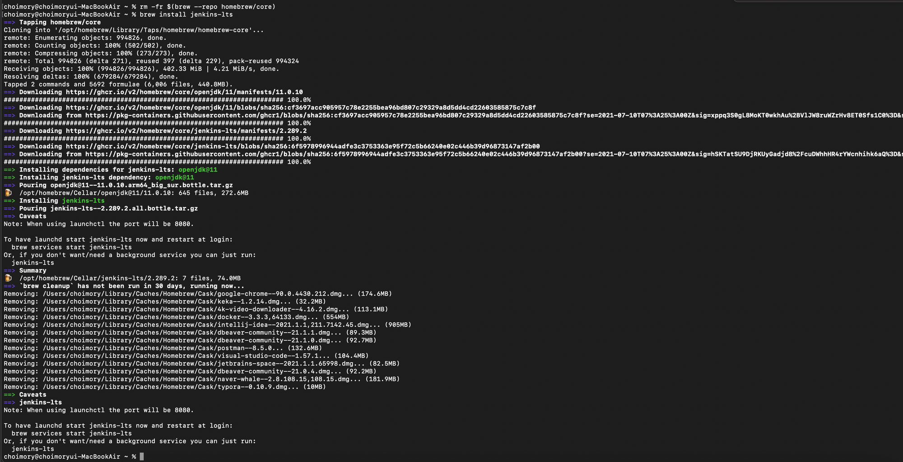
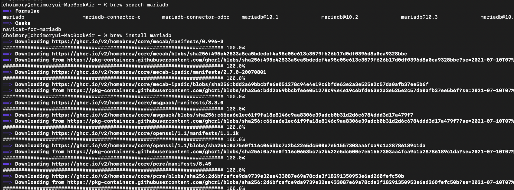

# 개요

- MySQL, MariaDB, Jenkins 등등 아주 기본적인 프로그램도 Homebrew에서 검색이 안되고
- 수동으로 brew install 명령어를 찾아 입력해도 오류와 함께 설치가 안될때
- Homebrew core를 지우고 재설치해주면 된다

# 오류



```java
choimory@choimoryui-MacBookAir ~ % brew install jenkins-lts
Updating Homebrew...
fatal: Could not resolve HEAD to a revision
==> Auto-updated Homebrew!
Updated 1 tap (homebrew/cask).
==> Updated Casks
Updated 24 casks.

==> Searching for similarly named formulae...
Error: No similarly named formulae found.
==> Searching for a previously deleted formula (in the last month)...
Error: No previously deleted formula found.
==> Searching taps on GitHub...
Error: No formulae found in taps.
choimory@choimoryui-MacBookAir ~ % brew install jenkins-lts
==> Searching for similarly named formulae...
Error: No similarly named formulae found.
==> Searching for a previously deleted formula (in the last month)...
Error: No previously deleted formula found.
==> Searching taps on GitHub...
Error: No formulae found in taps.
choimory@choimoryui-MacBookAir ~ % brew search mariadb
==> Casks
navicat-for-mariadb
choimory@choimoryui-MacBookAir ~ % brew info jenkins-lts
Error: No available formula or cask with the name "jenkins-lts".
==> Searching for a previously deleted formula (in the last month)...
Error: No previously deleted formula found.
choimory@choimoryui-MacBookAir ~ % clear
```

- brew search mariadb를 해보면 mariadb가 나오지 않는다
- brew install jenkins-lts를 직접 찾아 입력해보면, 검색에 실패하며 설치에 실패한다

# 해결



> `rm -fr $(brew --repo homebrew/core)`

- 홈브루 코어 삭제 후 brew install 명령어 재입력
- 그러면 homebrew core가 재설치되고, brew install 했던 프로그램까지 올바르게 설치되며 정상작동을 시작함



- MariaDB도 다시 검색되는 모습