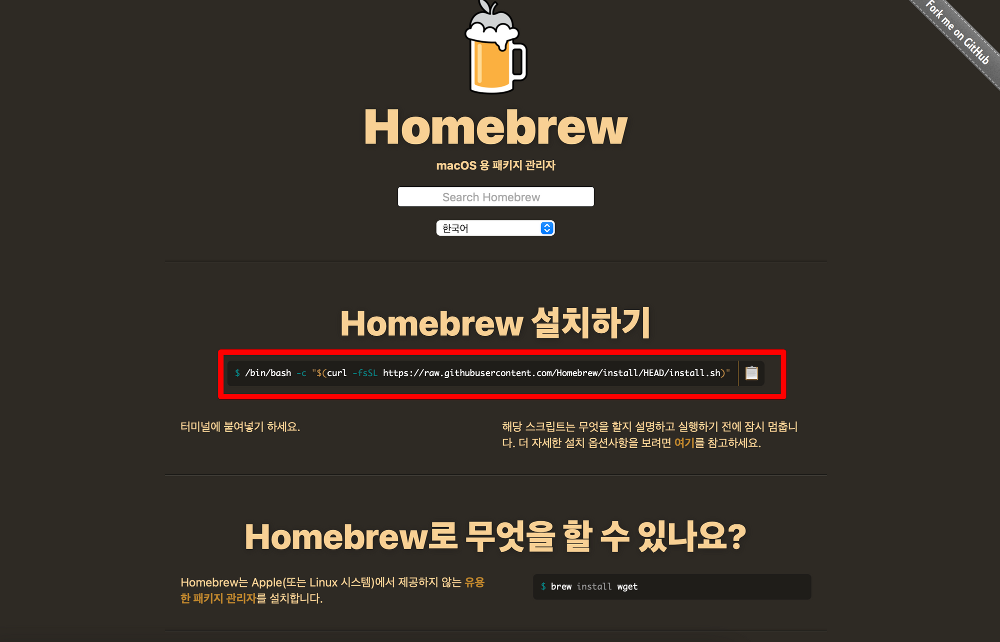
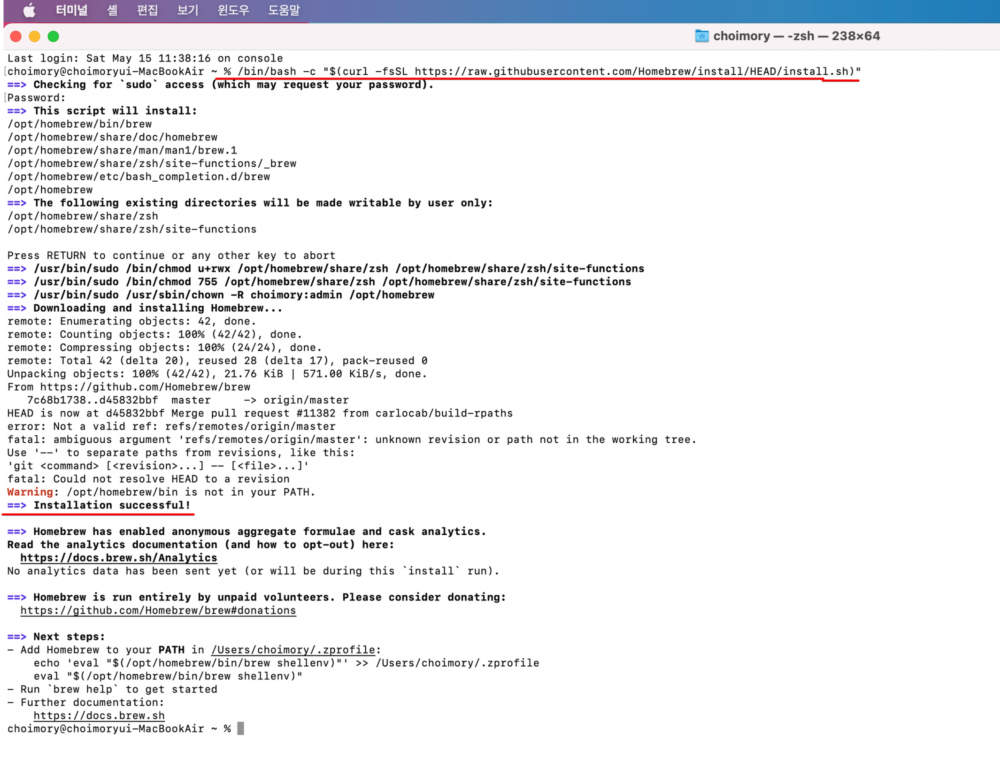
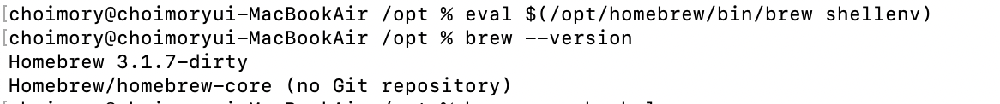
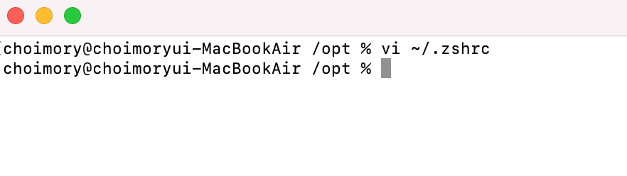
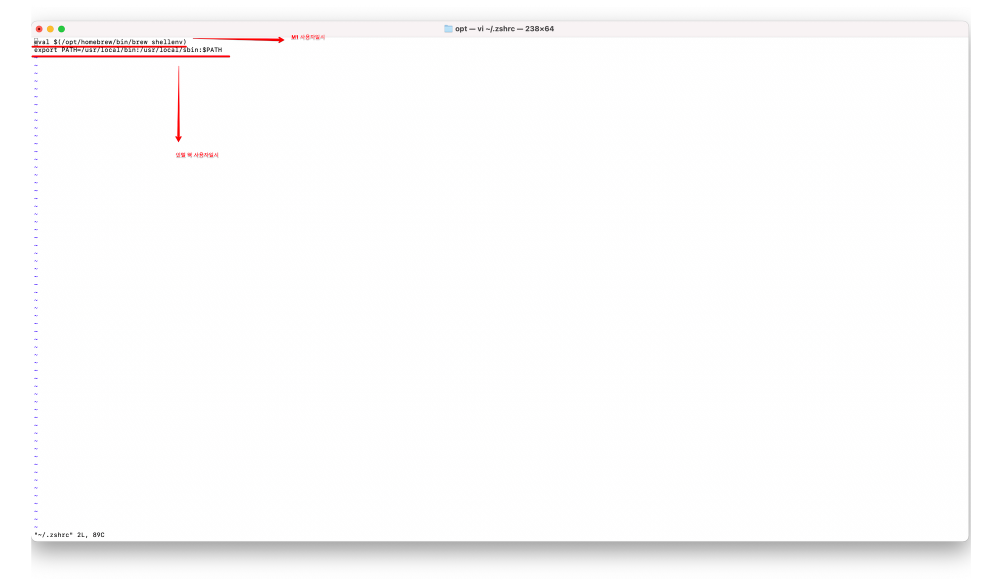
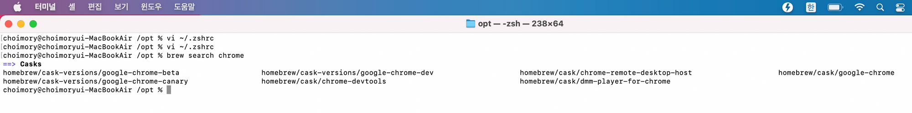
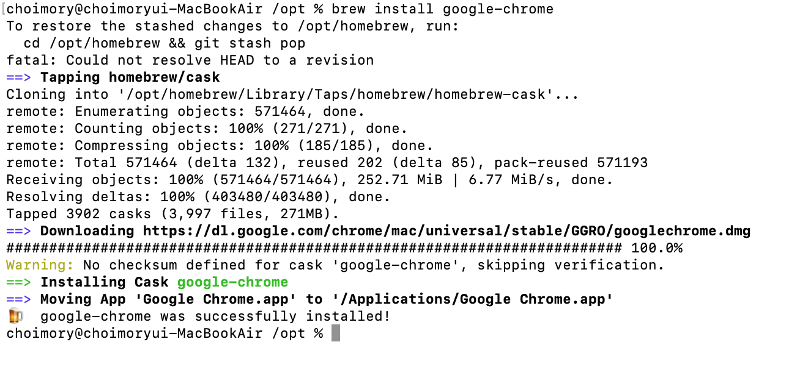

# Homebrew?

- MacOS 터미널 명령어로 프로그램들을 설치할 수 있게 해주는 패키지 관리자 프로그램

# Homebrew 설치

> 해당 내용은 애플 실리콘 M1 맥북 환경에서 작성함

- Homebrew 공식 사이트에서 제공하는 주소 복사

- 애플 터미널 앱에서 링크 붙여넣고 설치 성공 확인

- 설치 확인을 위해 간단한 homebrew 명령어를 실행해봤으나 실행되지 않는다.
- 이는 homebrew가 돌아가고 있지 않거나(M1) 환경변수 설정을 해주지 않았기 때문(인텔)으로 향후 사용의 편리를 위해 같이 작업해주자

- `eval $(/opt/homebrew/bin/brew shellenv)` 를 통해 homebrew를 가동한 뒤, 명령어를 실행하면 정상 동작한다
- 그러나 매번 가동시켜주고 작업할 수 는 없기에 추가 설정해준다

- `vi ~/.zshrc`로 zshrc 파일을 연 뒤

- M1 사용자일시 `eval $(/opt/homebrew/bin/brew shellenv)` 를 추가해준다. homebrew가 자동실행되게 해주는 내용이다.
- 인텔 맥 사용자일시 `export PATH=/usr/local/bin:/usr/local/sbin:$PATH`를 추가해준다. 환경변수에 homebrew를 추가해주는 내용이다.

# 패키지 검색

- `brew search 프로그램명`을 통해 설치하고 싶은 프로그램의 패키지 지원 여부 및 종류를 확인 가능하다

# 패키지 정보 확인

- `brew info 패키지명`을 통해 해당 패키지의 정보를 확인할 수 있다

# 패키지 설치

- `brew install 패키지명` 을 통해 해당 패키지를 설치 할 수 있다

# BrewFile

> BrewFile 에 brew, cask, mas 등의 원하는 패키지 설치 목록들을 저장해 놓으면, Homebrew 로 이들을 단번에 설치할 수 있다

# 참고

- [https://designdepot.tistory.com/209](https://designdepot.tistory.com/209)
- [https://blog.gangnamunni.com/post/brew_cask_mas/](https://blog.gangnamunni.com/post/brew_cask_mas/)
- [https://www.44bits.io/ko/keyword/homebrew](https://www.44bits.io/ko/keyword/homebrew#%ED%8C%A8%ED%82%A4%EC%A7%80-%EA%B2%80%EC%83%89%ED%95%98%EA%B3%A0-%EC%83%81%EC%84%B8-%EC%A0%95%EB%B3%B4-%ED%99%95%EC%9D%B8%ED%95%98%EA%B8%B0)