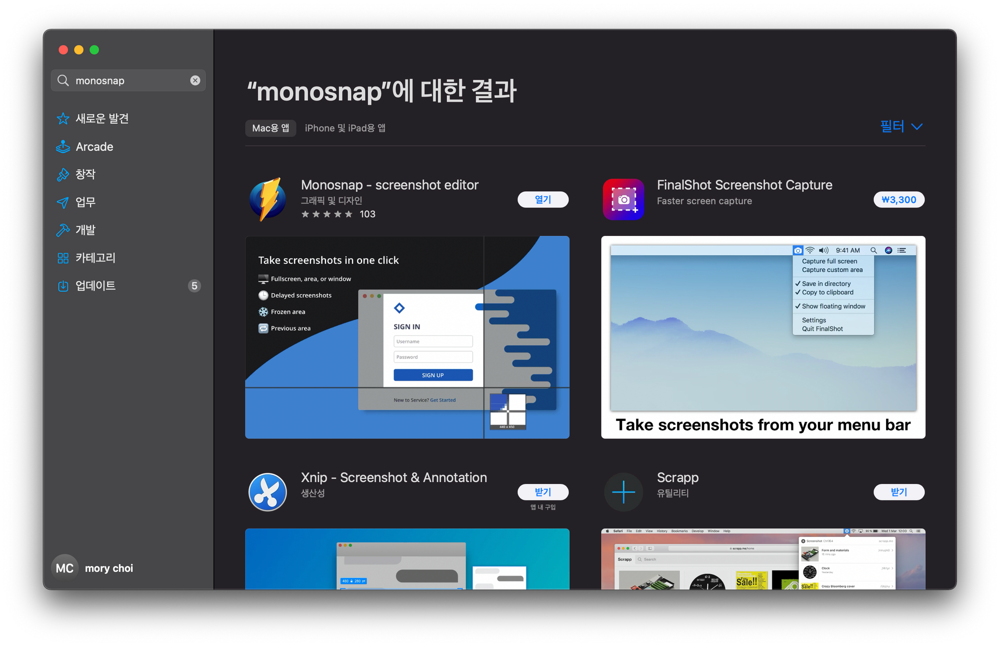

# 개요

- Mac의 기본 화면캡쳐 기능이 부실하여 보통 화면캡쳐 서드파티 앱을 사용하는데 그 중 monosnap앱을 서술함
- 해당 앱의 아쉬운점은 메모리사용량이 누적되어 계속 커지므로 가끔씩 재가동 해주는게 좋음

# 설치

- App store에서 monosnap 설치

# 사용

- 부분 캡쳐 : `Cmd + Opt + 5`
    - 드래그하면 드래그 부분영역 캡쳐가 되며, 특정 창을 클릭하면 특정 창 캡쳐가 됨
- 전체 화면 캡쳐 : `Cmd + Opt + 6`